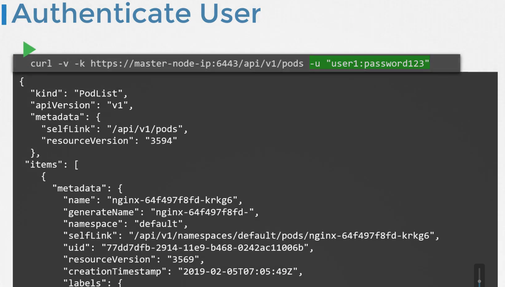

# Authentication


## Static passwords & token files

After that restart kube-apiserver  
If k8s is installed with kubeadm, modify ```/etc/kubernetes/manifests/kube-apiserver.yaml```

To authenticate:



## Setup
Setup basic authentication on Kubernetes (Deprecated in 1.19)  
Note: This is not recommended in a production environment. This is only for learning purposes. Also, note that this approach is deprecated in Kubernetes version 1.19 and is no longer available in later releases.

Follow the below instructions to configure basic authentication in a kubeadm setup. Create a file with user details locally at /tmp/users/user-details.csv

### User File Contents
```
password123,user1,u0001
password123,user2,u0002
password123,user3,u0003
password123,user4,u0004
password123,user5,u0005
```

Edit the kube-apiserver static pod configured by kubeadm to pass in the user details. The file is located at /etc/kubernetes/manifests/kube-apiserver.yaml

```yaml
apiVersion: v1
kind: Pod
metadata:
  name: kube-apiserver
  namespace: kube-system
spec:
  containers:
  - command:
    - kube-apiserver
      
    image: k8s.gcr.io/kube-apiserver-amd64:v1.11.3
    name: kube-apiserver
    volumeMounts:
    - mountPath: /tmp/users
      name: usr-details
      readOnly: true
  volumes:
  - hostPath:
      path: /tmp/users
      type: DirectoryOrCreate
    name: usr-details
```
Modify the kube-apiserver startup options to include the basic-auth file:
```yaml
apiVersion: v1
kind: Pod
metadata:
  creationTimestamp: null
  name: kube-apiserver
  namespace: kube-system
spec:
  containers:
  - command:
    - kube-apiserver
    - --authorization-mode=Node,RBAC
      
    - --basic-auth-file=/tmp/users/user-details.csv
```
Create the necessary roles and role bindings for these users:

```yaml
---
kind: Role
apiVersion: rbac.authorization.k8s.io/v1
metadata:
  namespace: default
  name: pod-reader
rules:
- apiGroups: # "" indicates the core API group
  resources: ["pods
  verbs: ["get", "watch", "lis
```
This role binding allows "jane" to read pods in the "default" namespace.:
```yaml
---
kind: RoleBinding
apiVersion: rbac.authorization.k8s.io/v1
metadata:
  name: read-pods
  namespace: default
subjects:
- kind: User
  name: user1 # Name is case sensitive
  apiGroup: rbac.authorization.k8s.io
roleRef:
  kind: Role #this must be Role or ClusterRole
  name: pod-reader # this must match the name of the Role or ClusterRole you wish to bind to
  apiGroup: rbac.authorization.k8s.io
```
Once created, you may authenticate into the kube-api server using the users credentials ```curl -v -k https://localhost:6443/api/v1/pods -u "user1:password123"```