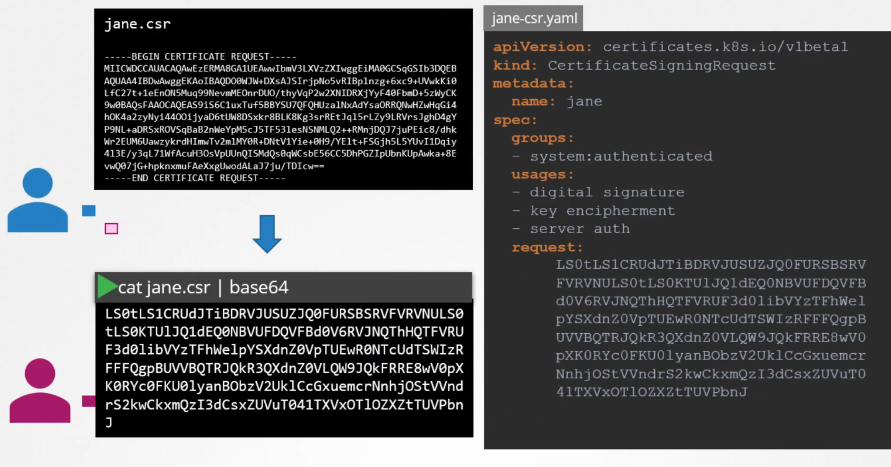

# Authentication using TLS

## Admin cert
Cert for admin needs to have SYSTEM:MASTERS prefix (specified as O in cert):


Authenticating with certs to apiserver: either in curl or with kube-config:


## K8s component certs
Other system components must also have prefix "SYSTEM":


same for kube-controller-manager & kube-proxy

worker nodes also need to be prefixed with "system:node" and must be in group "SYSTEM:NODES":


Correct group is necessary to assign correct permissions.

## Certificates API


then ```kubectl certificate approve jane``` and cert is ready to be copied from ```kubectl get csr jane -o yaml```

other csr with v1:

```yaml
apiVersion: certificates.k8s.io/v1
kind: CertificateSigningRequest
metadata:
  name: akshay
spec:
  groups:
  - system:authenticated
  signerName: kubernetes.io/kube-apiserver-client
  usages:
  - client auth
  request: 
    LS0tLS1CRUdJTiBDRVJUSUZJQ0FURSBSRVFVRVNULS0tLS0KTUlJQ1ZqQ0NBVDRDQVFBd0VURVBNQTBHQTFVRUF3d0dZV3R6YUdGNU1JSUJJakFOQmdrcWhraUc5dzBCQVFFRgpBQU9DQVE4QU1JSUJDZ0tDQVFFQXlVZURYblAwdk5TOUtIYmJ3RjlpTml0RjV0WEx3NUsxLzY0LzVnSFBqQk1HCkxYaEsvZUFPOERiUDlKSHZxV3V3cGx2Y25mTVlvQ0VkQnEwM0FEYjZESk90Y3RRMVNFakNPc1A4ZDh4cUpsQjgKKzVQdGQycVdBQWQzWElJL1J2Z1EvWDhxTFRQbStCZTFMVjdGUUMxMnhhZ0lKN3Q5OWp3UFNaWnVJRTkvRS9DegpXOWUvbEYzbWRLVFlZTkxBTTRIYXovNE1veGRTZXBIaGtBa3V0cTZvblNKay94ZE5ZeUs2T1NTTlF4bzVBMGNNCjRrMisvOVpBMTg2aHFuMHZ2cE44UG0yOUxaUW5lT0hySmxTRlROUVRENE0zQ3RBL0pKN3JGY0QrMzJXb1FuM3IKdWQxbkQwRVFaL1dJS0U2RjhNZDBZTmtFc0JsazlFMzVUVU1Tc0RTek9RSURBUUFCb0FBd0RRWUpLb1pJaHZjTgpBUUVMQlFBRGdnRUJBR04rWnB0L3pGdHFYUjByNGZkWGg2M0g4N2F6UCtFMWhwb2ptam1mbTU1em15WEdNVWphCnhuV01IQ1liNE5jQVRMN2JuVGQ1ODlMdzJQT3lBbTdWaTFMQSsySzJ1UVJWaCtLVlJCMHRyM0tOQ3BOeDBzNWwKeE91MENkMUQvblR1MnUwNjlHYTVZSGwzQWZDbzRnWWpmSjdBdk1MRWM3RjA2YTR4dTNzVC9aOEtXTVJBN3gwSQowTkVBT1czM0d4K2dGQ2psMEEyaEJleHRmQlgveHR3TWRscUpvbHg0elN6RkxGVnlCYnFHNHpIMWJkamk3alFhCnMvT0o2T2V4cDZHYlAxWjZFYm44L0t1QXJLdWQ0a3ZRRHdpbWt1bEUrNW1sQVRLMnFHY0pPU1pqRWRNVXVwN24KcUtpNzl6RlkzR1EyNkdHcFNMWU5waWdFb2t4alp3ZEgxbUE9Ci0tLS0tRU5EIENFUlRJRklDQVRFIFJFUVVFU1QtLS0tLQo=
```

who is responsible for this magic? Kube-controller-manager!


