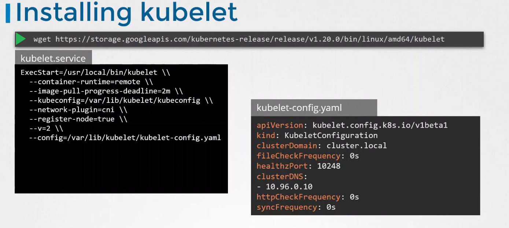
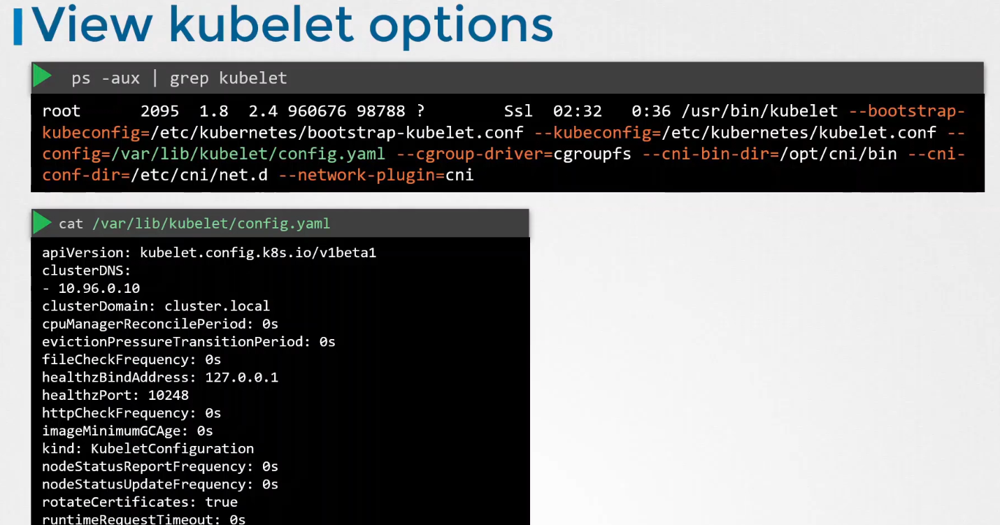
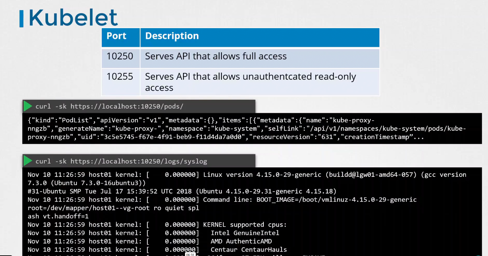
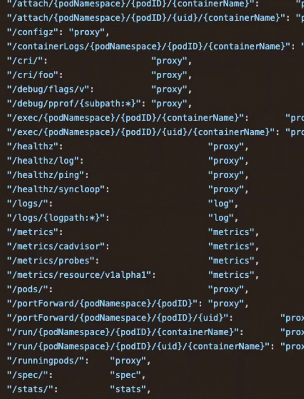
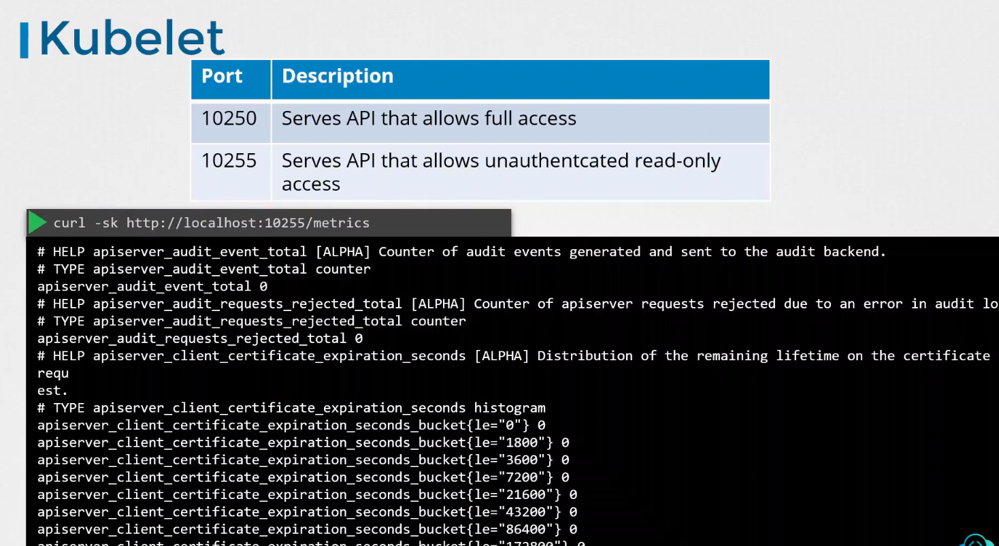
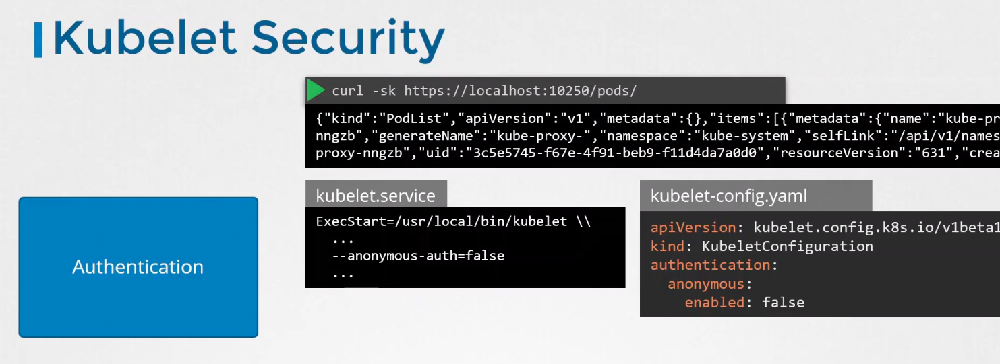
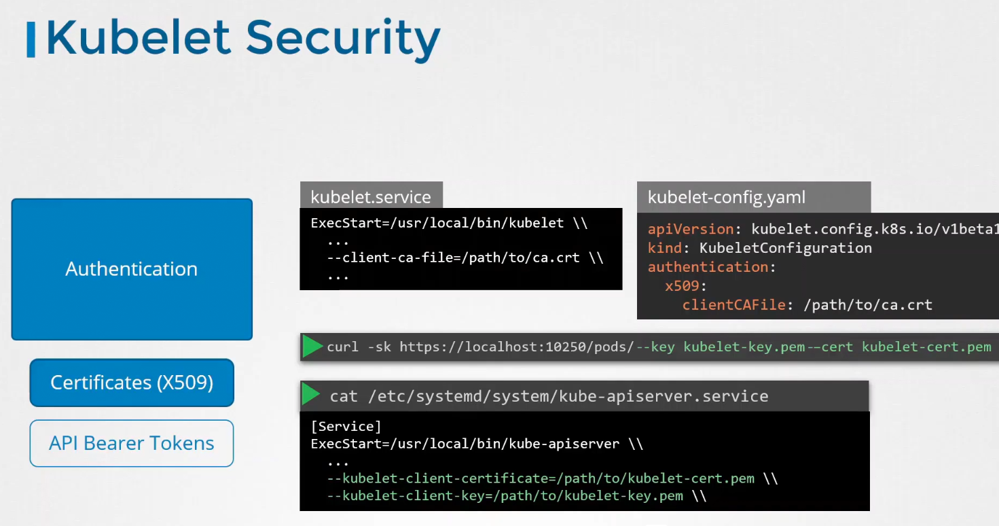
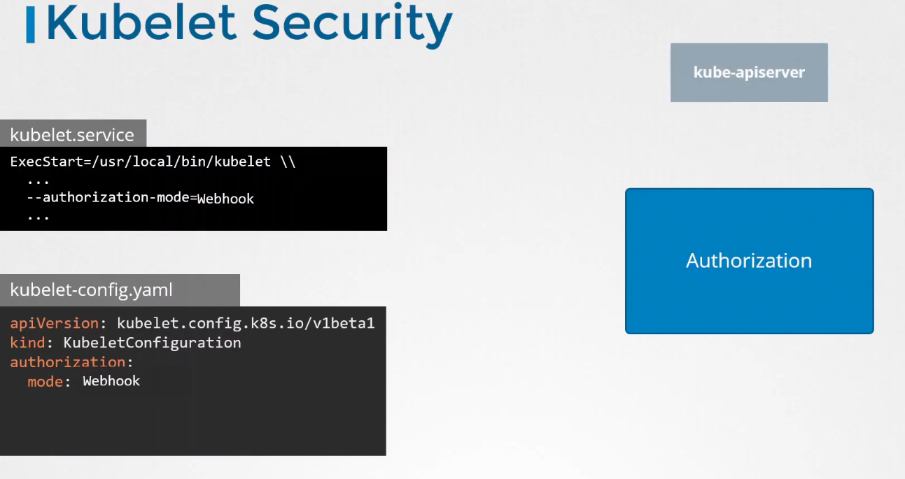
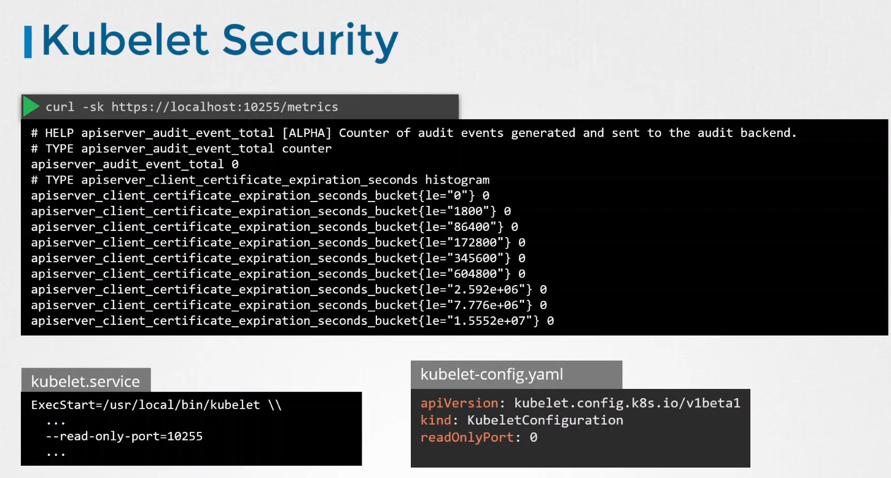

# Kubelet security

Kubelet config was moved to yaml:

other apis:

## Disable anonymous authentication
It's best practise.

## Enable authentication with certificates

## Authorization
Change from AlwaysAllow to Webhook - best practise

then kubelet talks to apiserver to check if request is allowed.

## Disable read-only port
Set readOnlyPort to 0:
