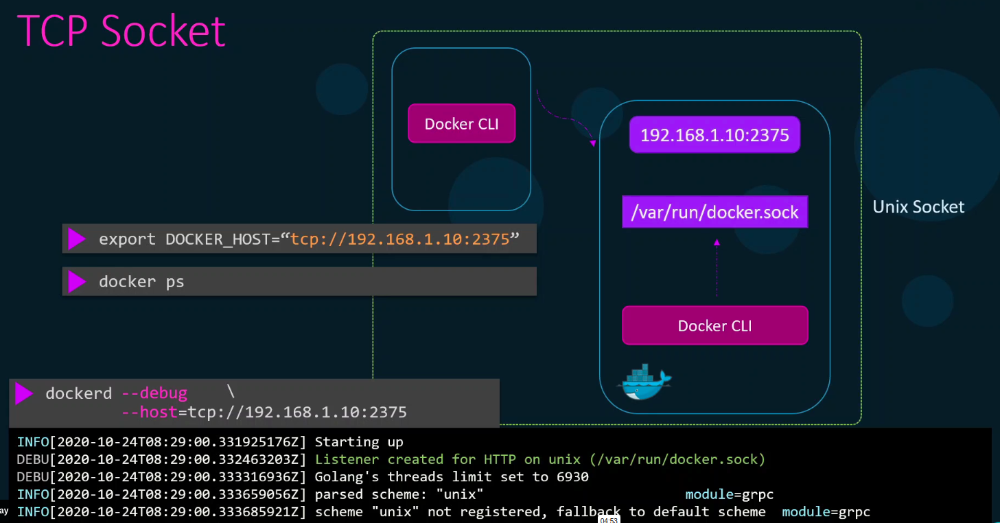
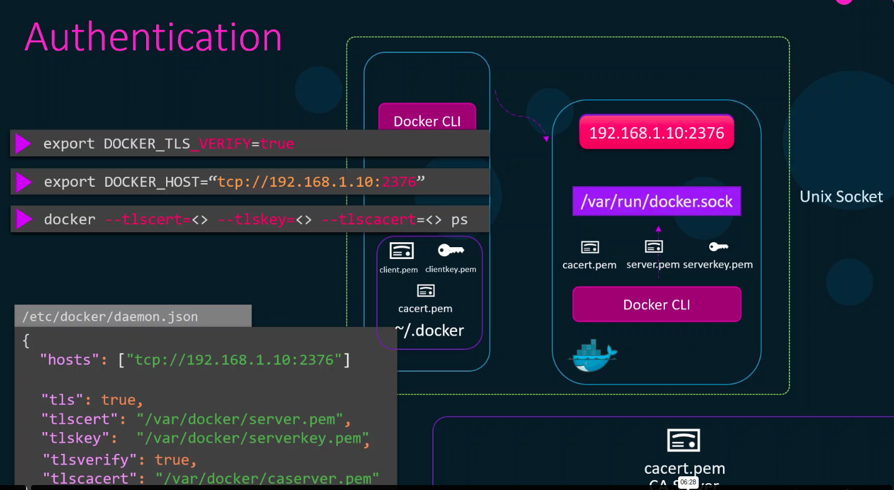

# Docker security

Manual start for debugging purposes: ```dockerd --debug```  
Docker CLI interacts with daemon. By default docker daemon is available only locally, but it can be exposed:


## Adding TLS

On docker CLI also ```export DOCKER_TLS=true``` is needed when TLS enabled (or add tls argument to docker binary: ```docker --tls ps``` etc.)

## Config in JSON
Docker SystemD service uses JSON config often in */etc/docker/daemon.json*

## Adding Client TLS authentication
tlsverify is set to true, so that client can only connect with client cert signed by CA that is configured on the host in tlscacert.
