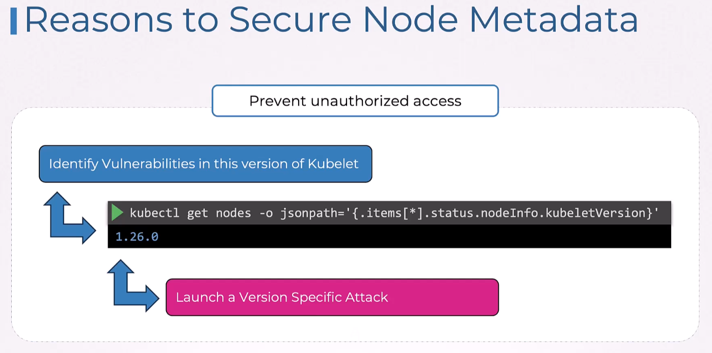
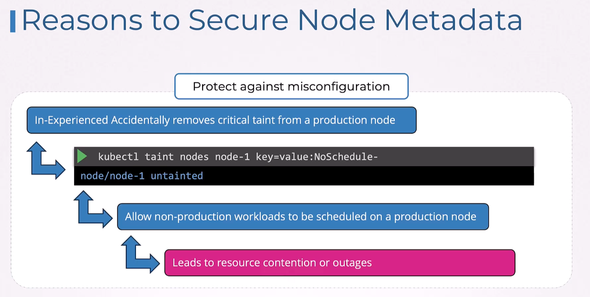
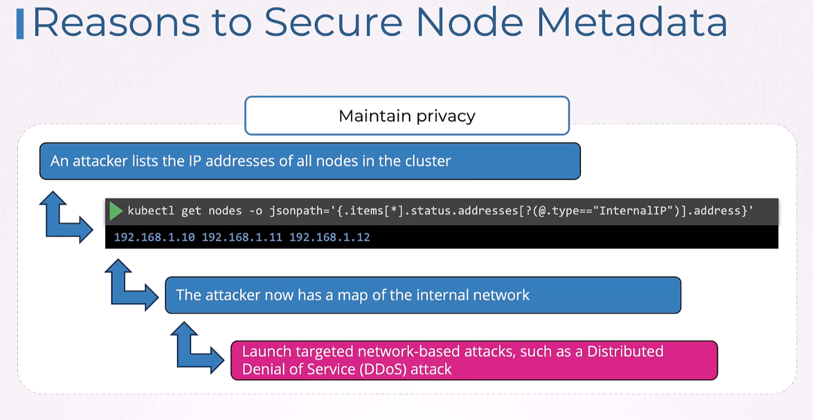
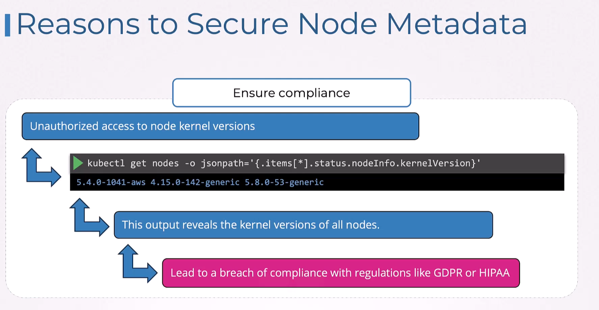

# Securing Node metadata






## Using network policy to disable access to AWS Metadata service

Now access is opened and metadata service is exposed on 9999:
```
oot@controlplane ~ ➜  kubectl get node controlplane -o wide
NAME           STATUS   ROLES           AGE     VERSION   INTERNAL-IP       EXTERNAL-IP   OS-IMAGE             KERNEL-VERSION       CONTAINER-RUNTIME
controlplane   Ready    control-plane   4h21m   v1.29.0   192.168.121.243   <none>        Ubuntu 22.04.4 LTS   5.15.0-117-generic   containerd://1.7.19

root@controlplane ~ ➜  kubectl exec app -- curl -s http://controlplane:9999|jq .|head
{
  "accountId": "123456789012",
  "architecture": "x86_64",
  "availabilityZone": "us-east-1a",
  "billingProducts": null,
  "devpayProductCodes": null,
  "marketplaceProductCodes": null,
  "imageId": "ami-0abcdef1234567890",
  "instanceId": "i-0abcdef1234567890",
  "instanceType": "t2.micro",

root@controlplane ~ ➜ 
```
Network policy to block:
```yaml
apiVersion: networking.k8s.io/v1
kind: NetworkPolicy
metadata:
  name: deny-metadata
  namespace: default
spec:
  podSelector:
    matchLabels:
      app: app
  policyTypes:
  - Egress
  egress:
  - to:
    - ipBlock:
        cidr: 0.0.0.0/0
        except:
        - <controlplane-ip>/32 # Replace with the actual IP address of the controlplane node
```

## Using RBC to restrict access to metadata

Open access to metadata:
```yaml
apiVersion: v1
kind: Pod
metadata:
  name: api-test-pod
  namespace: default
spec:
  containers:
  - name: api-test
    image: nginx
    command: ["sleep"]
    args: ["infinity"]
  serviceAccountName: node-viewer-service
  restartPolicy: Never
```
*node-viewer-service* SA is bound to node-viewer clusterrole:
```
controlplane ~ ➜  k describe clusterrole node-viewer
Name:         node-viewer
Labels:       <none>
Annotations:  <none>
PolicyRule:
  Resources  Non-Resource URLs  Resource Names  Verbs
  ---------  -----------------  --------------  -----
  nodes      []                 []              [get list watch]

controlplane ~ ➜  
```

access to metadata:
```
controlplane ~ ➜  kubectl exec -it api-test-pod -n default -- /bin/bash -c 'curl -k https://kubernetes.default.svc/api/v1/nodes -H "Authorization: Bearer $(cat /var/run/secrets/kubernetes.io/serviceaccount/token)"'
{
  "kind": "NodeList",
  "apiVersion": "v1",
  "metadata": {
    "resourceVersion": "1383"
  },
  "items": [
    {
      "metadata": {
        "name": "controlplane",
        "uid": "80b83e57-d002-44b0-b05b-c52b7f41181d",
        "resourceVersion": "1094",
```
So to restrict, RBAC for node resources must be disabled.