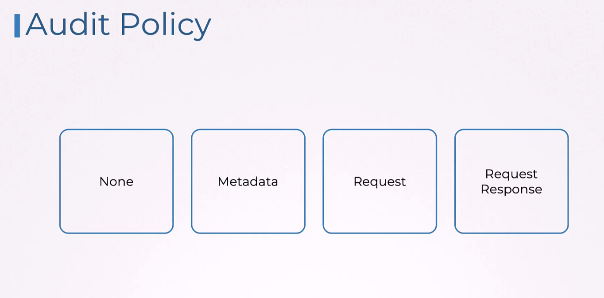

# Auditing

## Audit policy
From left to right verbosity increases:

None is used to exclude audit logs:

With Metadata we get audit logs for specified verbs and resources:

Apart from Metadata we can have request details:

Adding response (most verbose):
