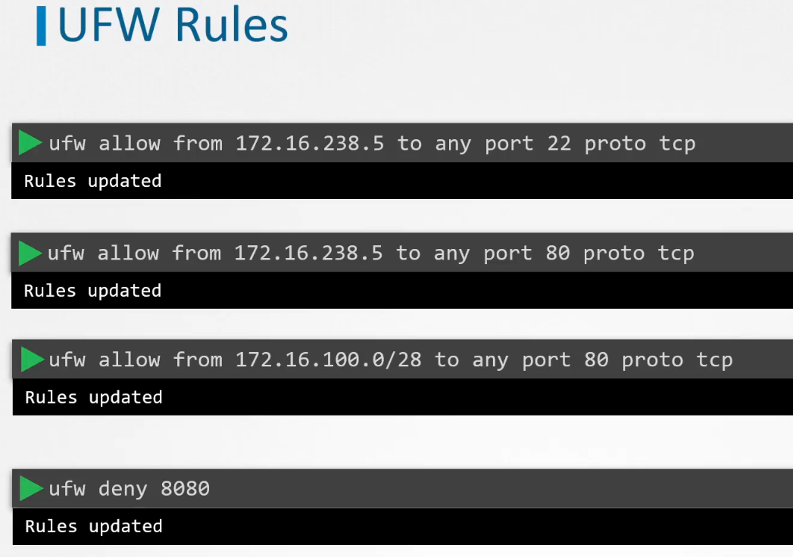

# UFW - Uncomplicated Firewall

Simple frontend for iptables.



To allow SSH: ```ufw allow 22```
To deny port 80: ```ufw deny 80```


## Allow range of ports
To allow ports from 1000 to 2000:
``` ufw allow 1000:2000/tcp```

## Reset UFW rules to default
```ufw reset```