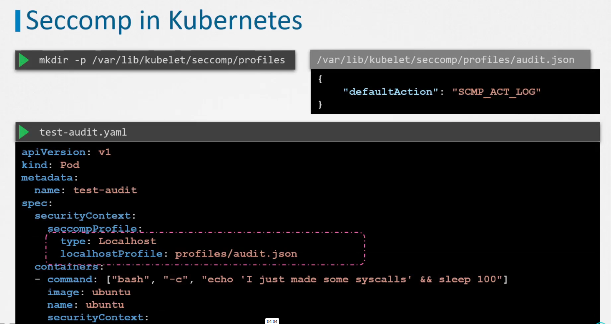

# Seccomp (secure computing)
Can be used to sandbox application to only use syscalls they need

value 2 means seccomp is enabled in container

## Default docker seccomp filter

## Whitelisting and blacklisting
Whitelisting blocks all and only enables selected ones.  
Blacklisting allows all and only disables selected ones (less secure).

## Blocked syscalls by default

## Custom seccomp
Disabling mkdir:

## Allow all syscalls

Unconfined allows all, but setting date still doesn't work because of other security mechanisms ([Capabilities](17_linux_capabilities.md)).

## Seccomp in kubernetes
Kubernetes unlike docker does not implement seccomp by default (it's set to unconfined):

To enable seccomp in a pod:

To enable custom seccomp profile in a pod:

How to read those syscall numbers?

Test what happens with profile that blocks everything:

