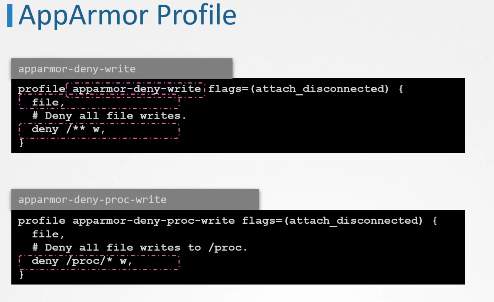
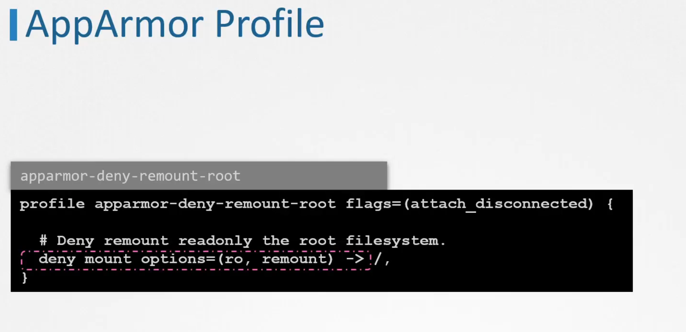
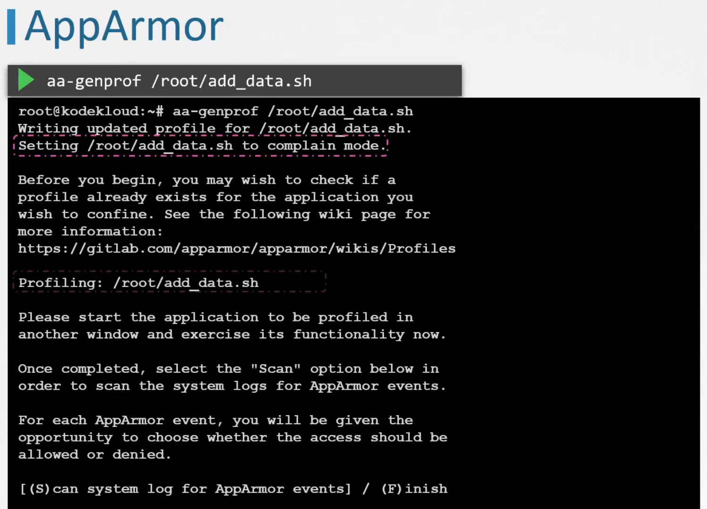
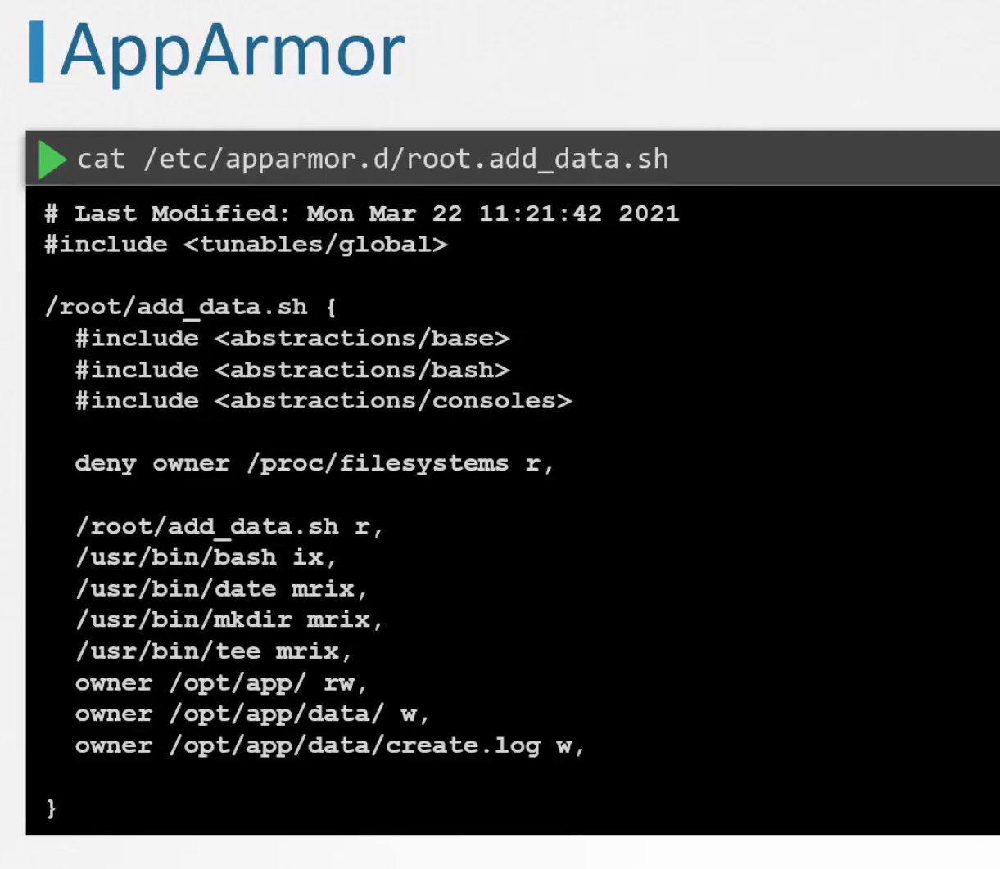
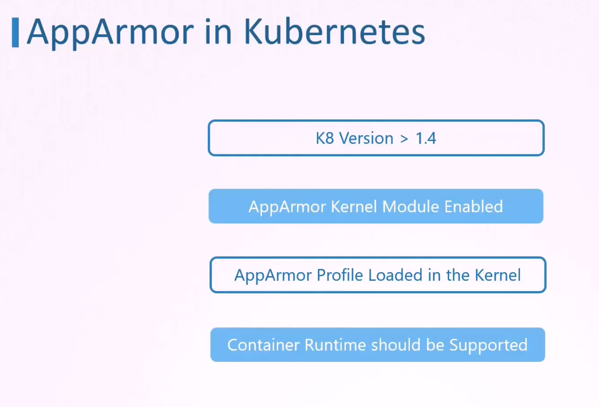
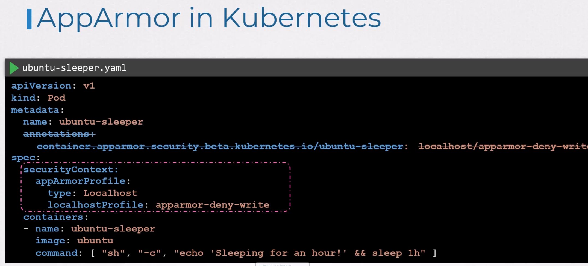
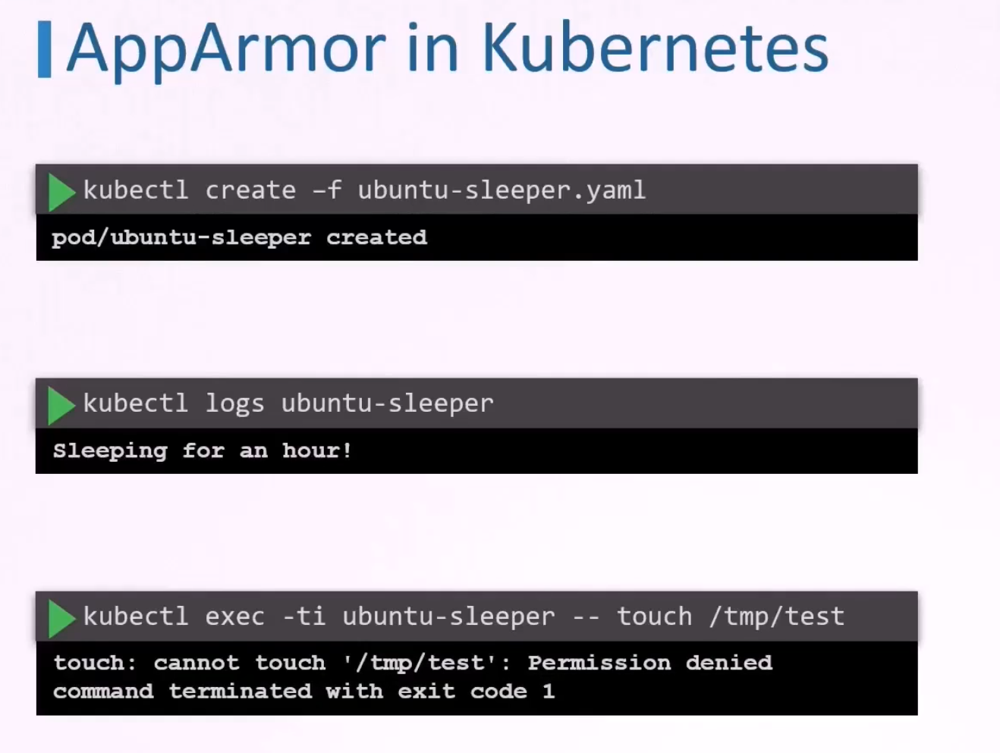

# AppArmor

With seccomp we can prevent syscalls from run. But we cannot restrict e.g. specific files/directories. For that we need AppArmor.

To check if AppArmor is enabled:
```
root@lglap:/home/lgawrons# cat /sys/module/apparmor/parameters/enabled 
Y
```

or ```# systemctl status apparmor```

To check enabled profiles:
```
root@lglap:/home/lgawrons# cat /sys/kernel/security/apparmor/profiles 
docker-default (enforce)
snap.snap-store.ubuntu-software (enforce)
snap.vlc.vlc (enforce)
snap.spotify.spotify (enforce)
snap.snap-store.ubuntu-software-local-file (enforce)
snap.snap-store.snap-store (enforce)
snap.snap-store.hook.configure (enforce)
snap.spotify.hook.configure (enforce)
snap.microk8s.version (complain)
snap.microk8s.status (complain)
snap.microk8s.stop (complain)
snap.microk8s.reset (complain)
snap.microk8s.start (complain)
snap.microk8s.refresh-certs (complain)
snap.microk8s.remove-node (complain)
snap.microk8s.microk8s (complain)
snap.microk8s.kubectl (complain)
snap.microk8s.leave (complain)
snap.microk8s.linkerd (complain)
snap.microk8s.inspect (complain)
snap.microk8s.join (complain)
snap.microk8s.istioctl (complain)
snap.microk8s.images (complain)
snap.microk8s.hook.remove (complain)
snap.microk8s.hook.install (complain)
snap.microk8s.hook.post-refresh (complain)
snap.microk8s.hook.disconnect-plug-network-control (complain)
snap.microk8s.hook.connect-plug-system-observe (complain)
snap.microk8s.hook.connect-plug-process-control (complain)
snap.microk8s.hook.connect-plug-opengl (complain)
snap.microk8s.hook.connect-plug-network-observe (complain)
snap.microk8s.hook.connect-plug-network-control (complain)
snap.microk8s.hook.connect-plug-network (complain)
snap.microk8s.hook.connect-plug-network-bind (complain)
snap.microk8s.hook.connect-plug-mount-observe (complain)
snap.microk8s.hook.connect-plug-log-observe (complain)
snap.microk8s.hook.connect-plug-login-session-observe (complain)
snap.microk8s.hook.connect-plug-kernel-module-observe (complain)
snap.microk8s.hook.connect-plug-kernel-crypto-api (complain)
snap.microk8s.hook.connect-plug-kubernetes-support (complain)
snap.microk8s.hook.connect-plug-k8s-kubeproxy (complain)
snap.libreoffice.writer (enforce)
snap.microk8s.hook.connect-plug-k8s-journald (complain)
snap.microk8s.hook.connect-plug-k8s-kubelet (complain)
snap.microk8s.hook.connect-plug-home (complain)
snap.microk8s.hook.connect-plug-home-read-all (complain)
snap.libreoffice.math (enforce)
snap.microk8s.hook.connect-plug-hardware-observe (complain)
snap.microk8s.hook.connect-plug-fuse-support (complain)
snap.microk8s.hook.connect-plug-firewall-control (complain)
snap.microk8s.hook.connect-plug-dot-kube (complain)
snap.libreoffice.libreoffice (enforce)
snap.microk8s.hook.connect-plug-dot-config-helm (complain)
snap.microk8s.hook.connect-plug-docker-privileged (complain)
snap.microk8s.hook.connect-plug-docker-support (complain)
snap.microk8s.hook.connect-plug-cifs-mount (complain)
snap.microk8s.dbctl (complain)
snap.microk8s.hook.connect-plug-account-control (complain)
snap.microk8s.hook.configure (complain)
snap.microk8s.helm3 (complain)
snap.microk8s.helm (complain)
snap.microk8s.enable (complain)
snap.microk8s.disable (complain)
snap.libreoffice.impress (enforce)
snap.microk8s.dashboard-proxy (complain)
snap.microk8s.daemon-kubelite (complain)
snap.microk8s.daemon-k8s-dqlite (complain)
snap.microk8s.daemon-flanneld (complain)
snap.microk8s.daemon-etcd (complain)
snap.microk8s.daemon-containerd (complain)
snap.microk8s.daemon-cluster-agent (complain)
snap.microk8s.daemon-apiserver-proxy (complain)
snap.microk8s.daemon-apiserver-kicker (complain)
snap.microk8s.ctr (complain)
snap.microk8s.config (complain)
snap.libreoffice.draw (enforce)
snap.microk8s.cilium (complain)
snap.libreoffice.calc (enforce)
snap.libreoffice.base (enforce)
snap.microk8s.addons (complain)
snap.microk8s.add-node (complain)
snap.foliate.foliate (enforce)
snap.libreoffice.filebug (enforce)
snap.libreoffice.hook.configure (enforce)
snap.fbreader.fbreader (enforce)
snap.foliate.hook.configure (enforce)
snap.fbreader.hook.configure (enforce)
snap.kubectl.kubectl (complain)
snap.google-cloud-cli.kubectl (complain)
snap.google-cloud-cli.gcloud (complain)
snap.google-cloud-cli.gsutil (complain)
snap.google-cloud-cli.docker-credential-gcloud (complain)
snap.docker.nvidia-container-toolkit (enforce)
snap.google-cloud-cli.bq (complain)
snap.docker.hook.post-refresh (enforce)
snap.google-cloud-cli.anthoscli (complain)
snap.docker.hook.install (enforce)
snap.docker.hook.configure (enforce)
snap.docker.hook.connect-plug-graphics-core22 (enforce)
snap.docker.help (enforce)
snap-update-ns.snap-store (enforce)
snap.docker.docker (enforce)
snap-update-ns.spotify (enforce)
snap.docker.compose (enforce)
snap.docker.dockerd (enforce)
snap-update-ns.libreoffice (enforce)
snap.core.hook.configure (enforce)
snap-update-ns.foliate (enforce)
snap-update-ns.fbreader (enforce)
snap-update-ns.vlc (enforce)
snap.code.url-handler (complain)
snap.code.code (complain)
snap-update-ns.microk8s (enforce)
/snap/snapd/23258/usr/lib/snapd/snap-confine (enforce)
/snap/snapd/23258/usr/lib/snapd/snap-confine//mount-namespace-capture-helper (enforce)
/snap/core/17200/usr/lib/snapd/snap-confine (enforce)
/snap/core/17200/usr/lib/snapd/snap-confine//mount-namespace-capture-helper (enforce)
/snap/snapd/21759/usr/lib/snapd/snap-confine (enforce)
/snap/snapd/21759/usr/lib/snapd/snap-confine//mount-namespace-capture-helper (enforce)
snap-update-ns.kubectl (enforce)
snap-update-ns.google-cloud-cli (enforce)
snap-update-ns.docker (enforce)
snap-update-ns.code (enforce)
snap-update-ns.core (enforce)
libreoffice-soffice (complain)
libreoffice-soffice//gpg (enforce)
/usr/bin/evince-thumbnailer (enforce)
/usr/bin/evince-previewer (enforce)
/usr/bin/evince-previewer//sanitized_helper (enforce)
/usr/bin/evince (enforce)
/usr/bin/evince//sanitized_helper (enforce)
/usr/lib/snapd/snap-confine (enforce)
/usr/lib/snapd/snap-confine//mount-namespace-capture-helper (enforce)
/usr/sbin/cupsd (enforce)
/usr/sbin/cupsd//third_party (enforce)
/usr/lib/cups/backend/cups-pdf (enforce)
/{,usr/}sbin/dhclient (enforce)
/usr/lib/connman/scripts/dhclient-script (enforce)
/usr/lib/NetworkManager/nm-dhcp-helper (enforce)
/usr/lib/NetworkManager/nm-dhcp-client.action (enforce)
/usr/sbin/tcpdump (enforce)
lsb_release (enforce)
cri-containerd.apparmor.d (enforce)
/usr/sbin/cups-browsed (enforce)
libreoffice-senddoc (enforce)
man_groff (enforce)
man_filter (enforce)
/usr/bin/man (enforce)
libreoffice-oopslash (complain)
nvidia_modprobe (enforce)
nvidia_modprobe//kmod (enforce)
ippusbxd (enforce)
libreoffice-xpdfimport (enforce)
root@lglap:/home/lgawrons# 
```

other way: ``aa-status``:

```
root@lglap:/home/lgawrons# aa-status
apparmor module is loaded.
153 profiles are loaded.
76 profiles are in enforce mode.
   /snap/core/17200/usr/lib/snapd/snap-confine
   /snap/core/17200/usr/lib/snapd/snap-confine//mount-namespace-capture-helper
   /snap/snapd/21759/usr/lib/snapd/snap-confine
   /snap/snapd/21759/usr/lib/snapd/snap-confine//mount-namespace-capture-helper
   /snap/snapd/23258/usr/lib/snapd/snap-confine
   /snap/snapd/23258/usr/lib/snapd/snap-confine//mount-namespace-capture-helper
   /usr/bin/evince
   /usr/bin/evince-previewer
   /usr/bin/evince-previewer//sanitized_helper
   /usr/bin/evince-thumbnailer
   /usr/bin/evince//sanitized_helper
   /usr/bin/man
   /usr/lib/NetworkManager/nm-dhcp-client.action
   /usr/lib/NetworkManager/nm-dhcp-helper
   /usr/lib/connman/scripts/dhclient-script
   /usr/lib/cups/backend/cups-pdf
   /usr/lib/snapd/snap-confine
   /usr/lib/snapd/snap-confine//mount-namespace-capture-helper
   /usr/sbin/cups-browsed
   /usr/sbin/cupsd
   /usr/sbin/cupsd//third_party
   /usr/sbin/tcpdump
   /{,usr/}sbin/dhclient
   cri-containerd.apparmor.d
   docker-default
   ippusbxd
   libreoffice-senddoc
   libreoffice-soffice//gpg
   libreoffice-xpdfimport
   lsb_release
   man_filter
   man_groff
   nvidia_modprobe
   nvidia_modprobe//kmod
   snap-update-ns.code
   snap-update-ns.core
   snap-update-ns.docker
   snap-update-ns.fbreader
   snap-update-ns.foliate
   snap-update-ns.google-cloud-cli
   snap-update-ns.kubectl
   snap-update-ns.libreoffice
   snap-update-ns.microk8s
   snap-update-ns.snap-store
   snap-update-ns.spotify
   snap-update-ns.vlc
   snap.core.hook.configure
   snap.docker.compose
   snap.docker.docker
   snap.docker.dockerd
   snap.docker.help
   snap.docker.hook.configure
   snap.docker.hook.connect-plug-graphics-core22
   snap.docker.hook.install
   snap.docker.hook.post-refresh
   snap.docker.nvidia-container-toolkit
   snap.fbreader.fbreader
   snap.fbreader.hook.configure
   snap.foliate.foliate
   snap.foliate.hook.configure
   snap.libreoffice.base
   snap.libreoffice.calc
   snap.libreoffice.draw
   snap.libreoffice.filebug
   snap.libreoffice.hook.configure
   snap.libreoffice.impress
   snap.libreoffice.libreoffice
   snap.libreoffice.math
   snap.libreoffice.writer
   snap.snap-store.hook.configure
   snap.snap-store.snap-store
   snap.snap-store.ubuntu-software
   snap.snap-store.ubuntu-software-local-file
   snap.spotify.hook.configure
   snap.spotify.spotify
   snap.vlc.vlc
77 profiles are in complain mode.
   libreoffice-oopslash
   libreoffice-soffice
   snap.code.code
   snap.code.url-handler
   snap.google-cloud-cli.anthoscli
   snap.google-cloud-cli.bq
   snap.google-cloud-cli.docker-credential-gcloud
   snap.google-cloud-cli.gcloud
   snap.google-cloud-cli.gsutil
   snap.google-cloud-cli.kubectl
   snap.kubectl.kubectl
   snap.microk8s.add-node
   snap.microk8s.addons
   snap.microk8s.cilium
   snap.microk8s.config
   snap.microk8s.ctr
   snap.microk8s.daemon-apiserver-kicker
   snap.microk8s.daemon-apiserver-proxy
   snap.microk8s.daemon-cluster-agent
   snap.microk8s.daemon-containerd
   snap.microk8s.daemon-etcd
   snap.microk8s.daemon-flanneld
   snap.microk8s.daemon-k8s-dqlite
   snap.microk8s.daemon-kubelite
   snap.microk8s.dashboard-proxy
   snap.microk8s.dbctl
   snap.microk8s.disable
   snap.microk8s.enable
   snap.microk8s.helm
   snap.microk8s.helm3
   snap.microk8s.hook.configure
   snap.microk8s.hook.connect-plug-account-control
   snap.microk8s.hook.connect-plug-cifs-mount
   snap.microk8s.hook.connect-plug-docker-privileged
   snap.microk8s.hook.connect-plug-docker-support
   snap.microk8s.hook.connect-plug-dot-config-helm
   snap.microk8s.hook.connect-plug-dot-kube
   snap.microk8s.hook.connect-plug-firewall-control
   snap.microk8s.hook.connect-plug-fuse-support
   snap.microk8s.hook.connect-plug-hardware-observe
   snap.microk8s.hook.connect-plug-home
   snap.microk8s.hook.connect-plug-home-read-all
   snap.microk8s.hook.connect-plug-k8s-journald
   snap.microk8s.hook.connect-plug-k8s-kubelet
   snap.microk8s.hook.connect-plug-k8s-kubeproxy
   snap.microk8s.hook.connect-plug-kernel-crypto-api
   snap.microk8s.hook.connect-plug-kernel-module-observe
   snap.microk8s.hook.connect-plug-kubernetes-support
   snap.microk8s.hook.connect-plug-log-observe
   snap.microk8s.hook.connect-plug-login-session-observe
   snap.microk8s.hook.connect-plug-mount-observe
   snap.microk8s.hook.connect-plug-network
   snap.microk8s.hook.connect-plug-network-bind
   snap.microk8s.hook.connect-plug-network-control
   snap.microk8s.hook.connect-plug-network-observe
   snap.microk8s.hook.connect-plug-opengl
   snap.microk8s.hook.connect-plug-process-control
   snap.microk8s.hook.connect-plug-system-observe
   snap.microk8s.hook.disconnect-plug-network-control
   snap.microk8s.hook.install
   snap.microk8s.hook.post-refresh
   snap.microk8s.hook.remove
   snap.microk8s.images
   snap.microk8s.inspect
   snap.microk8s.istioctl
   snap.microk8s.join
   snap.microk8s.kubectl
   snap.microk8s.leave
   snap.microk8s.linkerd
   snap.microk8s.microk8s
   snap.microk8s.refresh-certs
   snap.microk8s.remove-node
   snap.microk8s.reset
   snap.microk8s.start
   snap.microk8s.status
   snap.microk8s.stop
   snap.microk8s.version
29 processes have profiles defined.
7 processes are in enforce mode.
   /usr/sbin/cups-browsed (1624098) 
   /usr/sbin/cupsd (1624096) 
   /usr/lib/cups/notifier/dbus (2745304) /usr/sbin/cupsd
   /usr/bin/kube-controllers (82088) cri-containerd.apparmor.d
   /snap/docker/2963/bin/dockerd (3137) snap.docker.dockerd
   /snap/docker/2963/bin/containerd (3478) snap.docker.dockerd
   /snap/snap-store/1216/usr/bin/snap-store (3758) snap.snap-store.ubuntu-software
22 processes are in complain mode.
   /snap/code/176/usr/share/code/code (3008162) snap.code.code
   /snap/code/176/usr/share/code/code (3008164) snap.code.code
   /snap/code/176/usr/share/code/code (3008165) snap.code.code
   /snap/code/176/usr/share/code/chrome_crashpad_handler (3008183) snap.code.code
   /snap/code/176/usr/share/code/code (3008198) snap.code.code
   /snap/code/176/usr/share/code/code (3008203) snap.code.code
   /snap/code/176/usr/share/code/code (3008215) snap.code.code
   /snap/code/176/usr/share/code/code (3008260) snap.code.code
   /snap/code/176/usr/share/code/code (3008272) snap.code.code
   /snap/code/176/usr/share/code/code (3008372) snap.code.code
   /snap/code/176/usr/share/code/code (3008437) snap.code.code
   /snap/code/176/usr/share/code/code (3008438) snap.code.code
   /snap/code/176/usr/share/code/code (3008439) snap.code.code
   /usr/bin/bash (3008500) snap.code.code
   /snap/code/176/usr/share/code/code (3008541) snap.code.code
   /snap/code/176/usr/share/code/code (3008726) snap.code.code
   /usr/bin/bash (1475) snap.microk8s.daemon-apiserver-kicker
   /snap/microk8s/7280/bin/sleep (3118799) snap.microk8s.daemon-apiserver-kicker
   /usr/bin/bash (7289) snap.microk8s.daemon-cluster-agent
   /snap/microk8s/7280/bin/cluster-agent (7327) snap.microk8s.daemon-cluster-agent
   /snap/microk8s/7280/bin/k8s-dqlite (1491) snap.microk8s.daemon-k8s-dqlite
   /snap/microk8s/7280/kubelite (3083488) snap.microk8s.daemon-kubelite
0 processes are unconfined but have a profile defined.
root@lglap:/home/lgawrons# 
```

## Writing profiles


### First profile
First rule: file - it's a shorthand for "allow access to entire filesystem"   
Second rule: ```deny /** w``` - deny write access to all files under / and subdirs

### Second profile
Second rule - deny writes only to /proc

### Profile that denies remount readonly the root filesystem


## Writing profiles with apparmor-utils
First install ```apt-get install apparmor-utils```

Let's say we have script */root/add_data.sh*. To create apparmor profile:



aa-genprof expects to run script in different window to scan for events, and then selectively allow them.
  
When allowing syscalls is done, ready profile resides in /etc/apparmor.d/:



## Working with current profiles

To load the profile:
``# apparmor_parser /etc/apparmor.d/root.add_data.sh``

To disable the profile:
```
# apparmor_parser -R /etc/apparmor.d/root.add_data.sh
# 
#ln -s /etc/apparmor.d/root.add_data.sh /etc/apparmor.d/disable/
#
```

## AppArmor in Kubernetes

Prerequisites:


Profile should be loaded on the worker node that will run the pod with this profile.



Striked-out version (with annotation) - is an old way.

To test:

