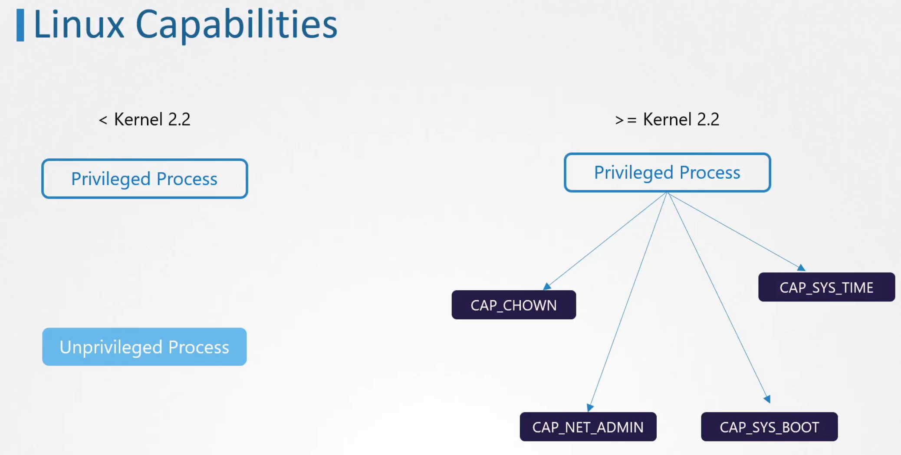
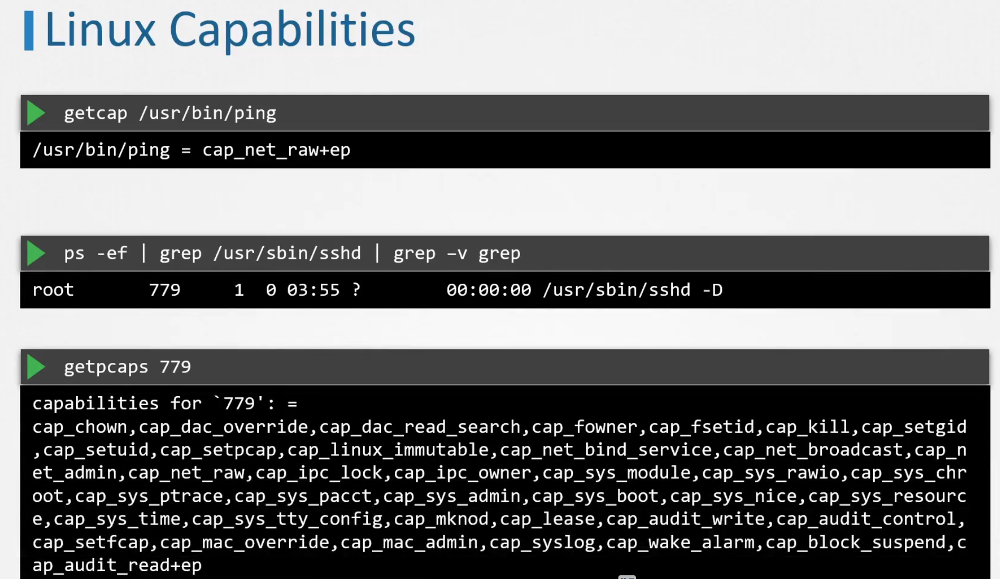
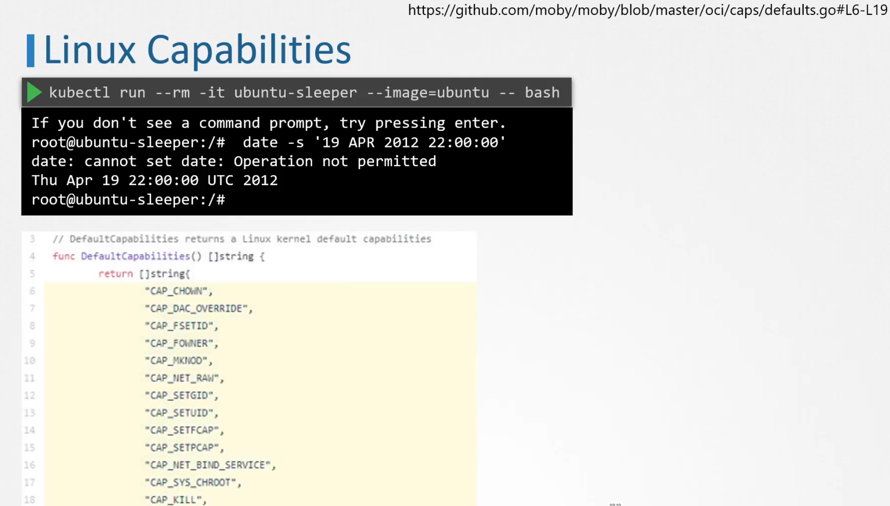
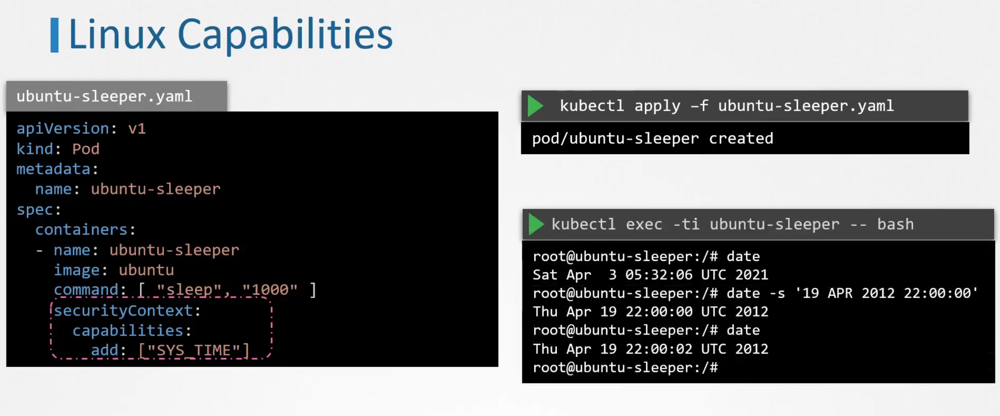
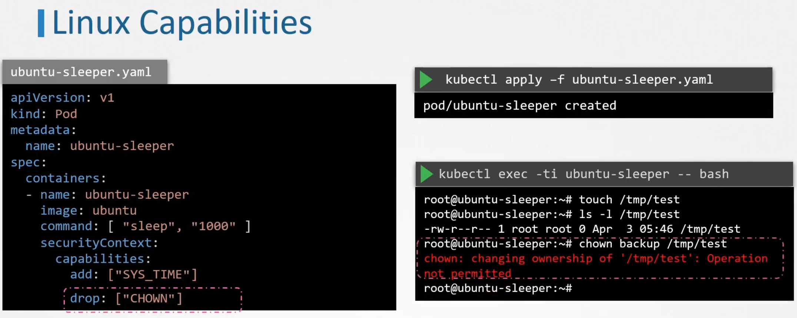

# Linux capabilities

Before kernel 2.2 privileged process could do anything. But starting from version 2.2 privileged process permissions were divided into capabilites:

## Checking which capabilites are required for processes

## Default capabilities in a linux kernel:
By default date cannot be changed because this capability is not enabled in kernel by default. So even if seccomp is set to unconfined, setting date will be denied:

## Adding capabilities to pods

## Dropping capabilities

