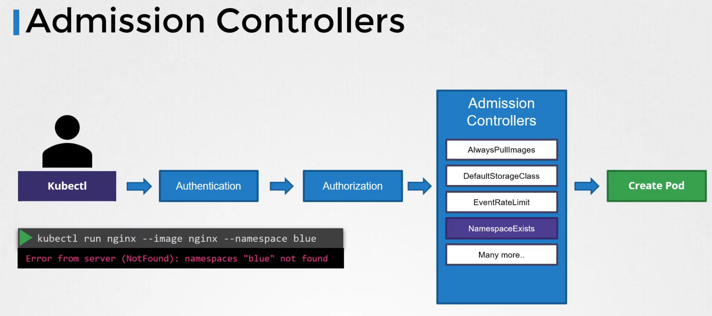
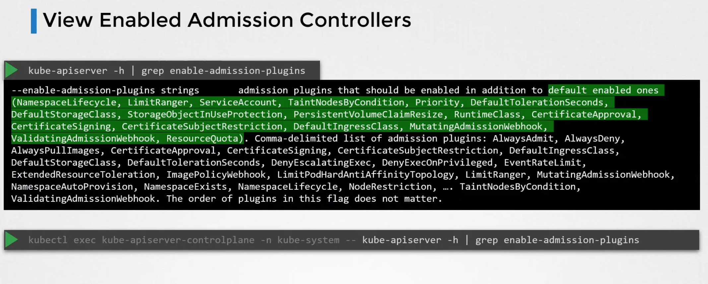
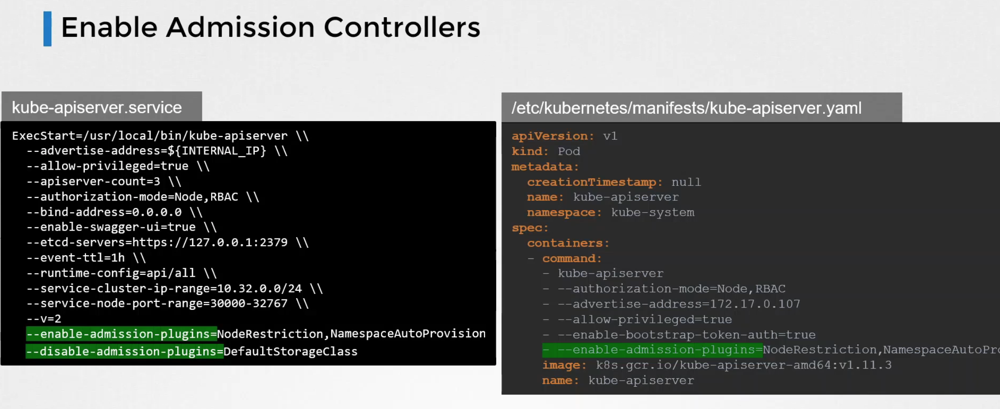
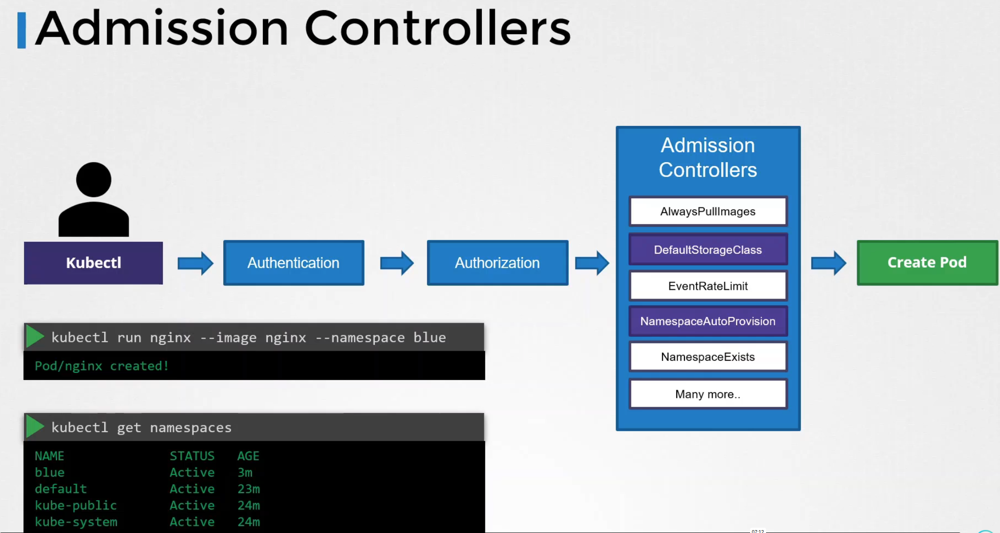
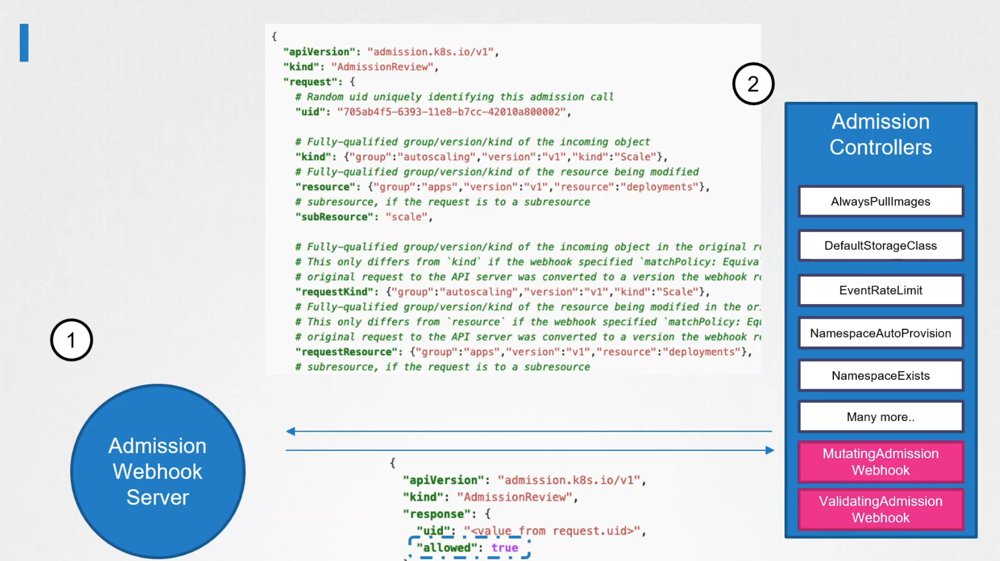
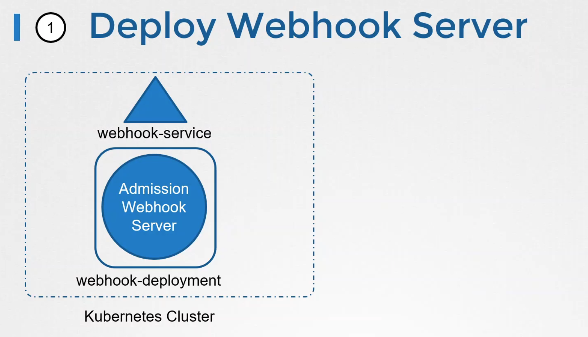
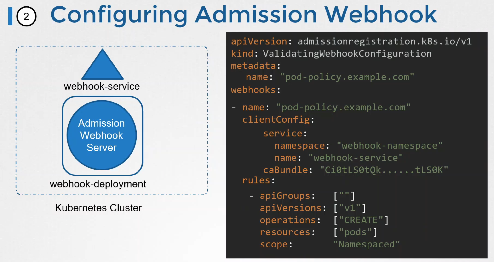

# Admission controllers

## Default admission controllers
E.g. namespace exists - to check for namespaces:

To check what are enabled admission controllers:

## Enabling and disabling admission controllers

### Enabling NamespaceAutoProvision
After we enable this admission controller, namespace will be created if it doesn't exists:

>NOTE: in newer k8s NamespaceAutoProvision & NamespaceExists is replaced with NamespaceLifecycle

## Validating & mutating admission controller

Validating - E.g. NamespaceExists - validates if namespace exists and rejects request if it does not.

Mutating - E.g. DefaultStorageClass - so that when request for PVC comes without storage class, request will be mutated and default storage class will be added.

Some admission controllers can be both validating and mutating. In this case mutation should come first.

## External Admission controllers
MutatingAdmissionWebhook and ValidatingAdmissionWebhook

### Custom webhook server
Can be deployed inside k8s

In this case every creation of pod will trigger call to webhook service and validation will be checked with returned json.
