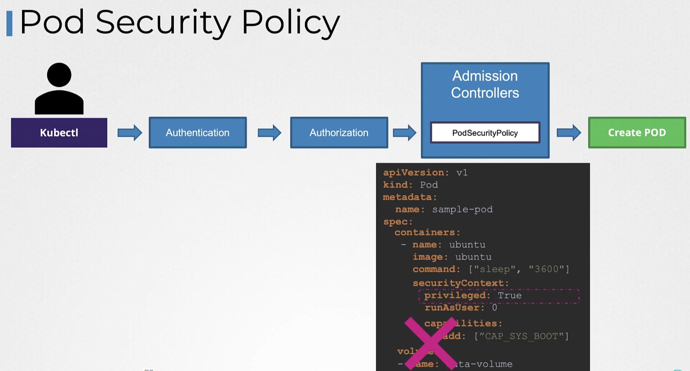
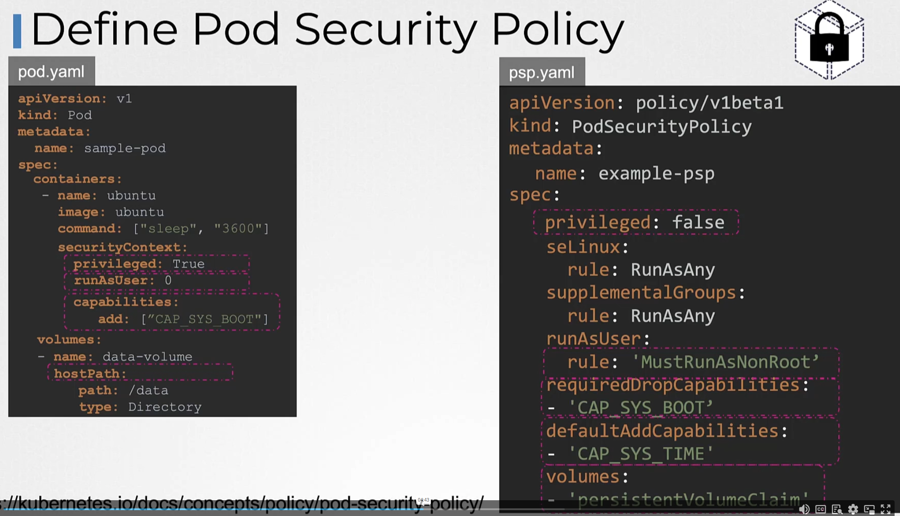
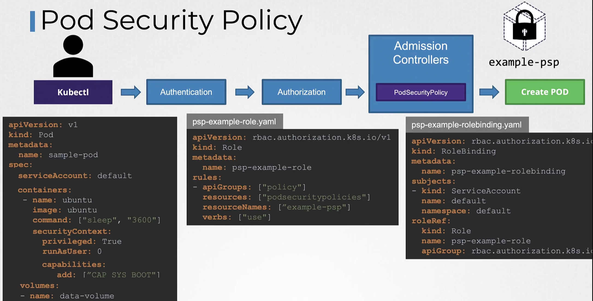

# Pod security policy (PSP)

Removed in v1.25 and replaced with newer:
* Pod Security Admission (PSA)
* Pod Security Standards (PSS)  

Those are stable in v1.25

## Old PSP
It's an admission controller that validates pod against preconfigured rules, and can deny if e.g. priviliged is set to True:

Those preconfigured rules are defined in a manifest of kind PodSecurityPolicy:

it's validating & mutating (adds default values and checks)

PSP is by default not enabled in admission controllers.  
PSP posed problems because person/service who was creating pods, must have also have access to PodSecurityPolicy.
Solution could be as follows:

So PSP was very cumbersome and hard to rollout.