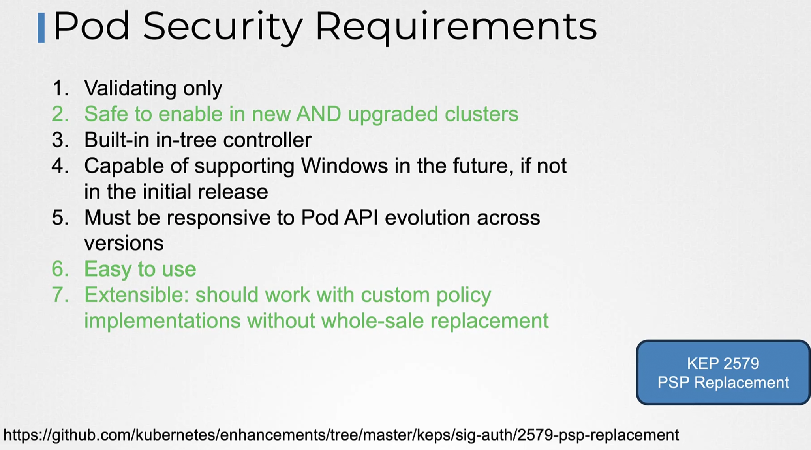
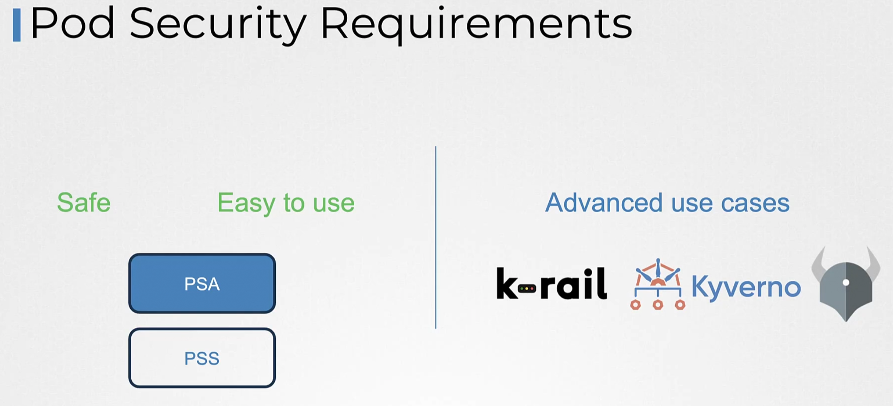
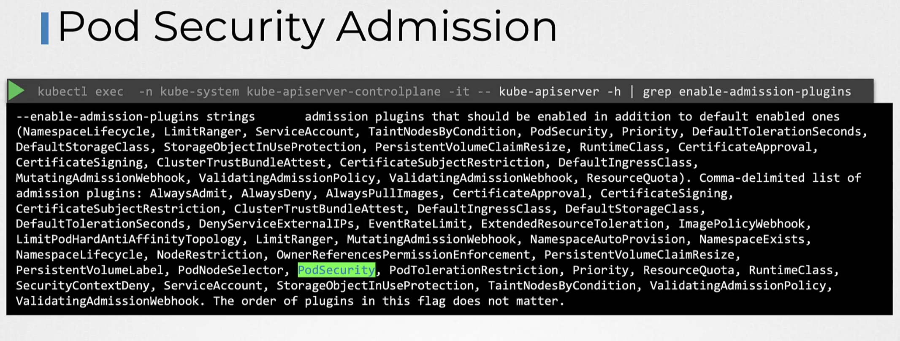
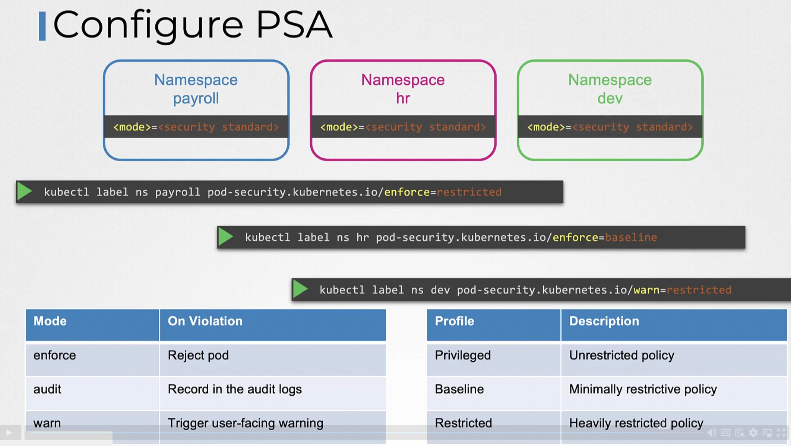
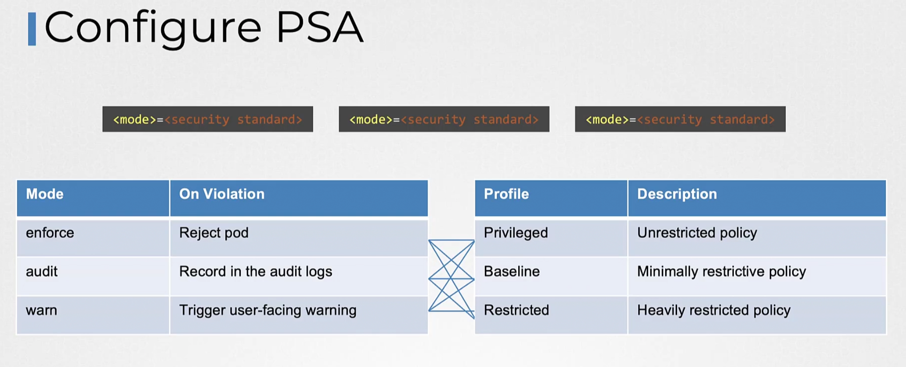
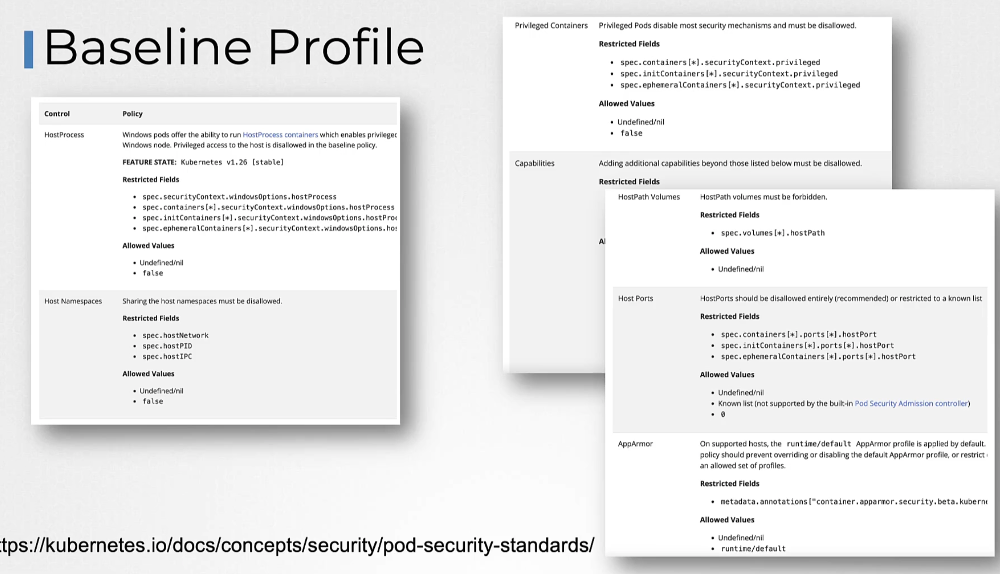
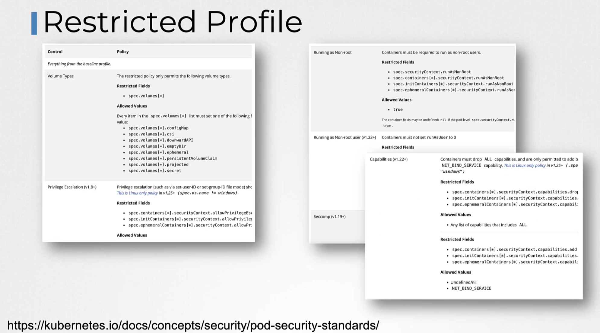

# PSA and PSS

The need of replacing cumbersome PSP:


PSA & PSS are only for simple use cases. Anything more advanced has to go to external solutions like OPA, Kyverno, etc.:


Should be enabled by default:


## Configuration of PSA
Labelling the namespace:

There are some predefined profiles (PSS) that let you choose security standard (privileged, baseline, and restricted):


## Predefined profiles (PSS)



## Understanding Pod Security Policy

Understanding Pod Security Policy
PodSecurityPolicy serves as an admission controller within Kubernetes, enabling cluster administrators to effectively manage security-related aspects of the Pod specification. By creating PodSecurityPolicy resources and defining requirements for Pods, administrators can control which Pods are allowed to run based on security policies. If a Pod complies with the defined PSP requirements, it is admitted to the cluster; otherwise, it is rejected.

### The Need for Pod Security Policy:
Kubernetes resources like Deployments, StatefulSets, and Services form the foundation of applications. However, RBAC alone, which controls access to these resources, does not consider the specific settings within the resources. PodSecurityPolicy was introduced to address this gap and provide fine-grained control over security-related fields in Pods. It enabled administrators to prevent privileges and settings that could pose security risks, without relying on external admission controllers.

Over time, it became evident that PodSecurityPolicy had inherent usability challenges that necessitated breaking changes.

PSP faces two major drawbacks: the absence of support for additional resource types and its limited set of controls that overlooks certain container runtime-specific characteristics. Other than that, several complexities are attached to PSPs.

1. Confusing Application of PSPs: Users often found it challenging to correctly apply PodSecurityPolicy to Pods, leading to unintended and broader permissions.
2. Limited Visibility: It was difficult to determine which PodSecurityPolicy applied to a specific Pod, making it hard to track and understand the security policies in place.
3. Limited Support for Changing Pod Defaults: Modifying default values for Pod settings through PodSecurityPolicy had limited scope, causing inconsistencies and unpredictability.
4. Lack of Audit Mode or Dry Run Capability: The absence of an audit mode or dry run capability made it impractical to assess the impact of PSPs before enforcing them or retrofitting them to existing clusters safely.
5. Challenges in Enabling PSP by Default: The complexities and potential risks associated with PodSecurityPolicy made it infeasible to enable it by default across clusters, limiting its widespread adoption.
  
These usability challenges collectively drove the need for breaking changes and a more user-friendly solution to secure Pod deployments, leading to the deprecation of PodSecurityPolicy in Kubernetes.

For further insights into these and other challenges related to PSP (Pod Security Policies), we recommend watching the SIG Auth’s Maintainer Track session video from KubeCon NA 2019. This video provides valuable information on PSP difficulties.

[SIG Auth Update and Deep Dive – Mo Khan, Red Hat; Mike Danese, Google; & Tim Allclair, Google ](https://youtu.be/SFtHRmPuhEw)

As you all know, In Kubernetes 1.21, PodSecurityPolicy (PSP) is being deprecated and removed from Kubernetes 1.25, paving the way for a replacement that offers improved functionality and sustainability.

### Transitioning to a New Pod Security Solution
With the phasing out and discontinuation of actively developed Pod Security Policies (PSPs), it becomes crucial for cluster administrators and operators to find alternative security measures. Fortunately, there are two promising options available to meet this need:

1. Policy-as-code (PAC) solutions within the Kubernetes ecosystem.
2. The Kubernetes Pod Security Standards (PSS) with Pod Security Admission (PSA)
In the Kubernetes community, several open source PAC solutions have emerged, providing a reliable alternative to PSPs. These solutions, although not officially part of the Kubernetes project, can be obtained from the Kubernetes ecosystem. Some notable examples of PAC solutions include:

* Kyverno 
* OPA/Gatekeeper
* Open Policy Agent (OPA)
* jsPolicy

Here comes the lesson topic,

#### Pod Security Admission (PSA) and Kubernetes Pod Security Standards (PSS).

The Pod Security Standards (PSS) and Pod Security Admission (PSA) were introduced by the Kubernetes Auth Special Interest Group (SIG) in response to the deprecation of the Pod Security Policy (PSP) and the ongoing requirement of managing pod security in Kubernetes. PSA is an integrated solution within Kubernetes that offers built-in capabilities for governing pod security. The solution incorporates a webhook project designed for admission controllers, which ensures enforcement of the controls outlined in the Pod Security Standards (PSS). This admission controller approach bears similarity to the functioning of PAC (Policy as Code) systems.

#### Bit about Pod Security Standards(PSS)

PSS defines three different security policies that cover a wide range of security needs. These policies are cumulative and vary in their level of restrictiveness:

1. Privileged: This policy grants the highest level of access without any restrictions. It is useful for system-wide programs like logging agents, CNIs, and storage drivers that require privileged access.
2. Baseline: This policy aims to be highly restrictive to prevent known privilege escalation while still allowing the use of the default Pod configuration with minimal alterations. The baseline policy imposes restrictions on specific capabilities, including hostNetwork, hostPID, hostIPC, hostPath, hostPort, and the addition of Linux capabilities.
3. Restricted: This strict policy follows current best practices for hardening Pods. It builds upon the baseline policy and adds additional constraints, such as prohibiting the Pod from running as the root user or in the root group. Restricted policies may affect the functionality of applications and are designed for running security-critical applications.


Read more about PSS in the official Kubernetes documentation: https://kubernetes.io/docs/concepts/security/pod-security-standards/

These policies define different execution profiles for Pods, categorized into privileged and limited access tiers.

#### Pod Security Admission(PSA) operates in three modes to enforce the controls defined by PSS:

**Enforce**: When this mode is enabled, the PSA evaluates the Pod against the policy. If the Pod fails to meet the policy requirements, it is rejected.

**Audit**: In this mode, the Pod is allowed to run even if it violates the policy. However, the violation is recorded in the Kubernetes audit log.

**Warn**: This mode generates a warning for any policy violation but does not prevent the Pod from running.

### Let’s Understand Namespace Labels in PSA
Namespace labels play a crucial role in implementing PSA. They determine the policy level that applies to all Pods within a specific namespace. Here’s how they work:

First, Label Key: The key used for labeling namespaces is pod-security.kubernetes.io/enforce, pod-security.kubernetes.io/audit, and pod-security.kubernetes.io/warn.

Then, Label Value: The value of these labels indicates the policy level to be enforced, audited, or warned. These levels are typically privileged, baseline, or restricted, aligning with the Pod Security Standards.

### Let’s take a look at an example scenario
In Enforce Mode:

In Enforce Mode:

The Namespace Label looks like this.. pod-security.kubernetes.io/enforce: restricted

The Effect will be that any Pod that doesn’t meet the ‘restricted’ PSS in this namespace will be rejected.

In the Audit Mode,

The Namespace Label looks like this.

 pod-security.kubernetes.io/audit: baseline

The Effect of this label will be that violations and violations of the ‘baseline’ PSS are logged in the audit log, but Pods are allowed to run.

Finally, the Warn Mode.

The Namespace Label is like this.

pod-security.kubernetes.io/warn: privileged

The Effect is that warnings and warnings are generated for any Pod that doesn’t meet the ‘privileged’ standard, but no enforcement occurs.

### Let’s get an idea about the practical considerations of these.
If no labels are present on a namespace, a default policy (usually the least restrictive) is applied.

Also, A namespace can have labels for all three modes, each specifying a different policy level.

Finally, Be cautious with changing labels, as escalating policy levels can lead to existing Pods being out of compliance.

More about configuring the built-in admission controller can be found here.

https://kubernetes.io/docs/tasks/configure-pod-container/enforce-standards-admission-controller/#configure-the-admission-controller

Imagine you’re setting up security in a Kubernetes cluster, using Pod Security Admission (PSA) to enforce certain rules. But, like in any good security system, you realize there are some special cases, some exceptions to the rule. That’s where PSA exemptions come in.

Think of PSA as a strict security guard, but one who knows that sometimes, specific people or situations need a bit of flexibility. Here are the key types of exemptions:

First, Usernames: It’s like having a VIP list. If a request comes from certain users – think of them as trusted individuals in your Kubernetes world – PSA steps aside and lets them through without the usual checks. These could be system administrators or automated processes that you know are safe.

Second, RuntimeClassNames: This is for those special types of Pods that need to run in a unique way, maybe for performance or compatibility reasons. When they have a particular runtime class name, they’re like guests with a special pass, exempt from the usual security checks.

Finally, the Namespaces: Sometimes, you have entire sections of your Kubernetes cluster where the standard rules don’t apply. In these ‘exempt namespaces,’ Pods can operate with more freedom, outside the usual security boundaries.

Now, how do you set these exemptions up? When configuring your Kubernetes API server, you can directly program these special passes into the PSA admission controller. It’s like giving the security guard a list of exceptions right from the start.

But there’s another way too. In the world of Kubernetes, you also have something called a Validating Webhook. Here, you can define exemptions in a more flexible way, using a Kubernetes ConfigMap resource. Think of this like a digital file that contains all the special rules and exemptions. This file is then placed right inside the ‘pod-security-webhook’ container, like handing over a constantly updating list of exceptions to your security guard.

In both cases, whether it’s directly through the API server or via the Validating Webhook, you’re ensuring that your Kubernetes cluster remains secure while also being flexible enough to accommodate special cases and needs.

And that, in a nutshell, is how PSA uses exemptions to maintain a balance between strict security and necessary flexibility in a Kubernetes environment.

## Migration Strategies: From PSP to PSA
let’s talk about moving from PodSecurityPolicy to Pod Security Admission in Kubernetes. It’s a bit like updating your software – you want to make sure everything runs smoothly without disrupting your work.

First things first, understand what you currently have. It’s like taking inventory. Look over your existing PSPs and note down what security policies you’ve got in place. This is your starting point.

Next up, get to know PSA. It’s important to understand how it works. PSA has three levels – Privileged, Baseline, and Restricted. Think about which level fits best with your current PSPs. It’s like choosing the right tool for the job.

Time for a test run with PSA in Audit Mode. Here, you’re just observing, not making any changes. Turn on PSA and see how your policies would work in real-time. It’s a bit like a dress rehearsal.

Now, translate your old PSPs into PSA policies. You’re basically updating your security measures. Find the closest match in PSA for each PSP, or write a new policy if you need to.

Before you go all in, use PSA in Warn Mode. This way, you’ll get alerts for any issues, but it won’t stop anything from running. It’s like having a friendly reminder before you make a big change.

Keep an eye on things. Monitor your audit and warning logs. This helps you see if there are any issues you need to fix. Think of it as fine-tuning your setup.

Ready to enforce your new policies? Switch from audit to enforce mode in PSA. Now, your policies are not just for show; they’re actually in effect.

Take it slow. Don’t rush into enforcing everything at once. Start with one area at a time, like focusing on a specific part of your project. This way, you can manage the changes better.

Keep everyone in the loop. Make sure your team knows about the new policies and how they work. Good communication is key to a smooth transition.

And lastly, don’t forget your resources. The Kubernetes documentation, blog posts, and GitHub repository are great places to look for more detailed information. They’re like your go-to guides.

By following these steps, you can switch from PSP to PSA with as little disruption as possible, keeping your Kubernetes environment secure and up-to-date.

## Let’s see Pod Security Standards in Action.
Here are practical examples of how different Pod Security Standards can be applied to a hypothetical pod spec:

First, the Privileged Level is appropriate for workloads that require all capabilities and access to the host.

```yaml
apiVersion: v1
kind: Pod
metadata:
  name: privileged-pod
spec:
  containers:
  – name: privileged-container
    image: nginx
    securityContext:
      privileged: true
```
Second, the Baseline Level, which is the default for most clusters, disallows privilege escalation.

```yaml
apiVersion: v1
kind: Pod
metadata:
  name: baseline-pod
spec:
  containers:
  – name: baseline-container
    image: nginx
    securityContext:
      allowPrivilegeEscalation: false
```
Finally, Restricted Level for workloads that require the highest level of security.
```yaml
apiVersion: v1
kind: Pod
metadata:
  name: restricted-pod
spec:
  securityContext:
    seccompProfile:
      type: RuntimeDefault
  containers:
  – name: restricted-container
    image: nginx
    securityContext:
      allowPrivilegeEscalation: false
      runAsNonRoot: true
      readOnlyRootFilesystem: true
```
In a real-world world scenario, 

A container that needs to manage the host’s network stack might require privileged access.

An API server that needs limited security permissions without escalation privileges would fit into baseline policies.

A payment processing app that handles sensitive data would benefit from the restricted level to minimize the attack surface.

Always refer to the latest Kubernetes documentation when implementing these examples, as details may have changed since my last update.