# Open Policy Agent (OPA)

Not taking k8s into consideration yet we need to run a server:
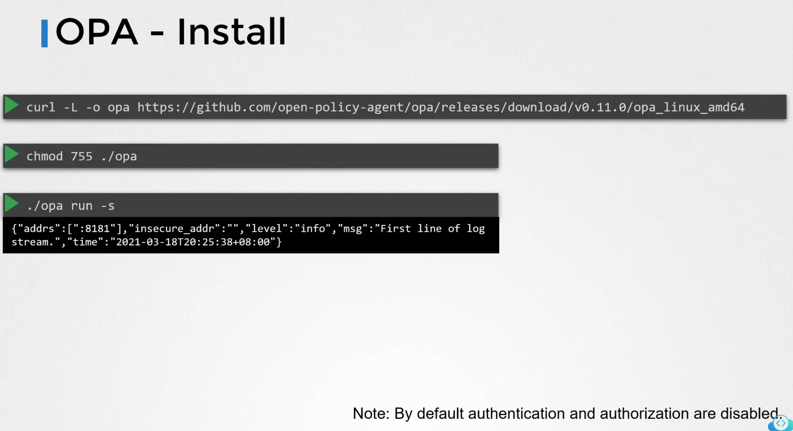
After OPA service is running we need to load policy:
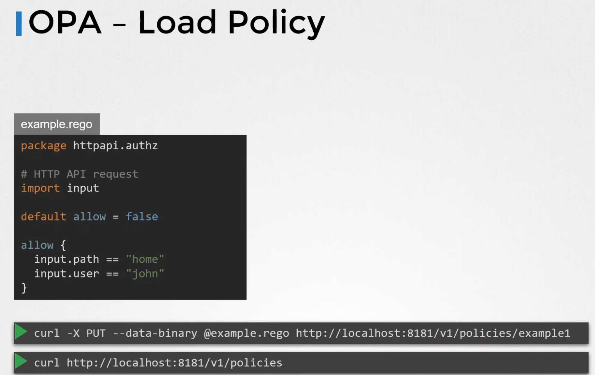
and apps can now use it:
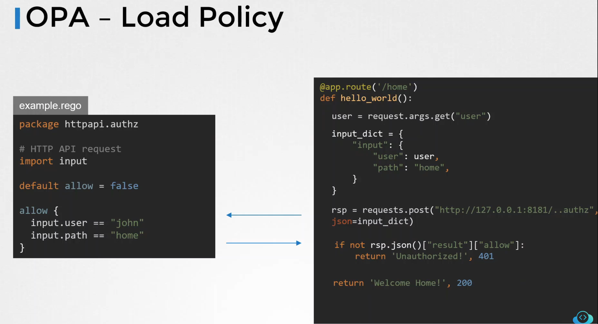

## Policy testing
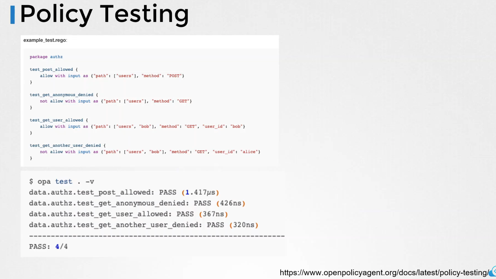

## OPA in Kubernetes
###Kube-mgmt
kube-mgmt manages policies / data of Open Policy Agent instances in Kubernetes.
  
kube-mgmt is uded to:  
* Load policies and/or static data into OPA instance from ConfigMap.
* Replicate Kubernetes resources including CustomResourceDefinitions (CRDs) into OPA instance.

## OPA Gatekeeper
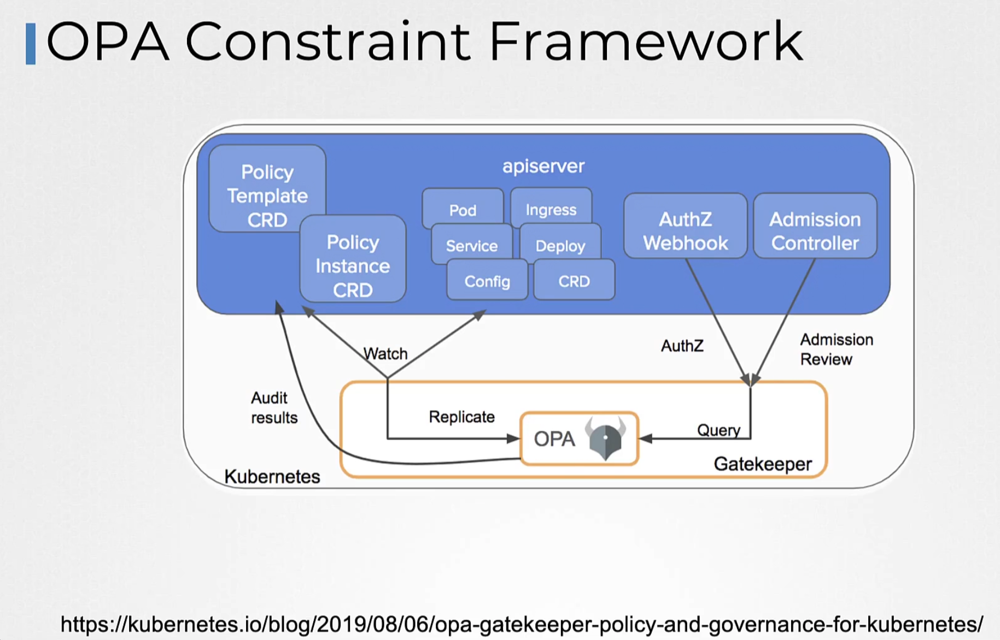
Installation - install according to instruction: https://open-policy-agent.github.io/gatekeeper/website/docs/install/

after installed make sure all components are running:
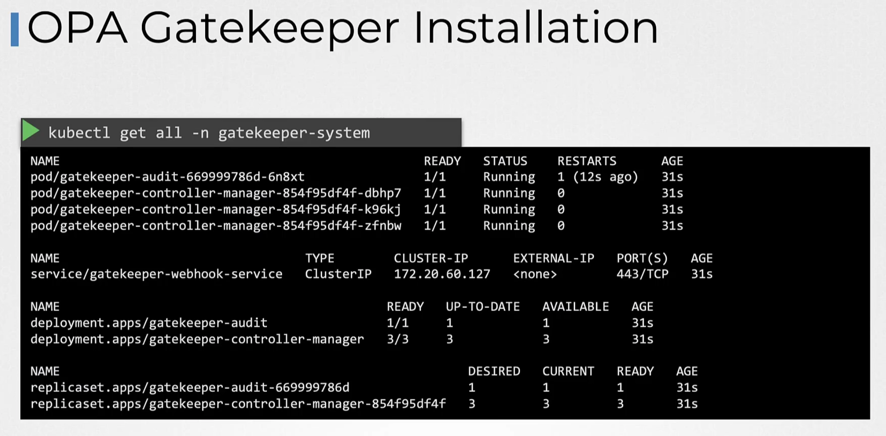
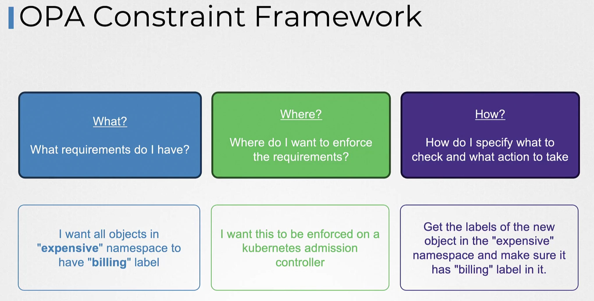
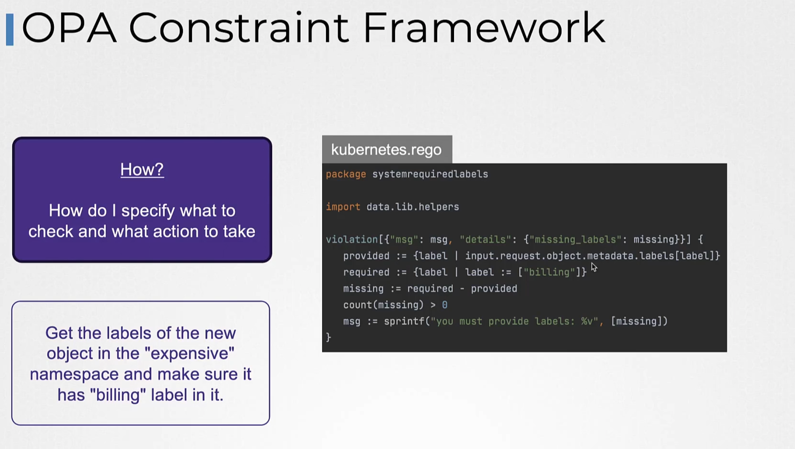
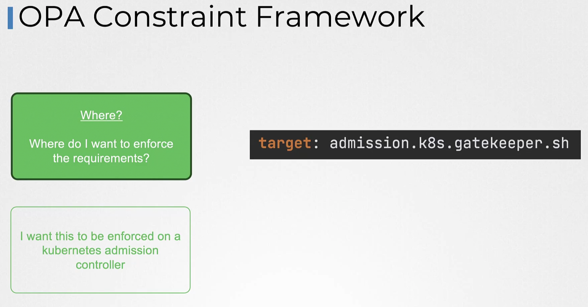
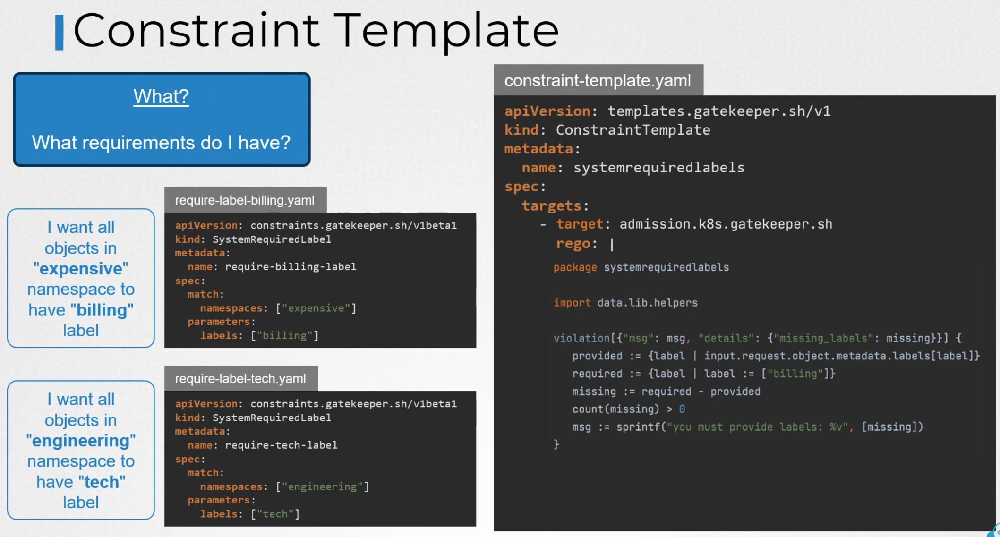
But label is still hardcoded in rego (we will modify it later).

How to make SystemRequiredLabel kind ?
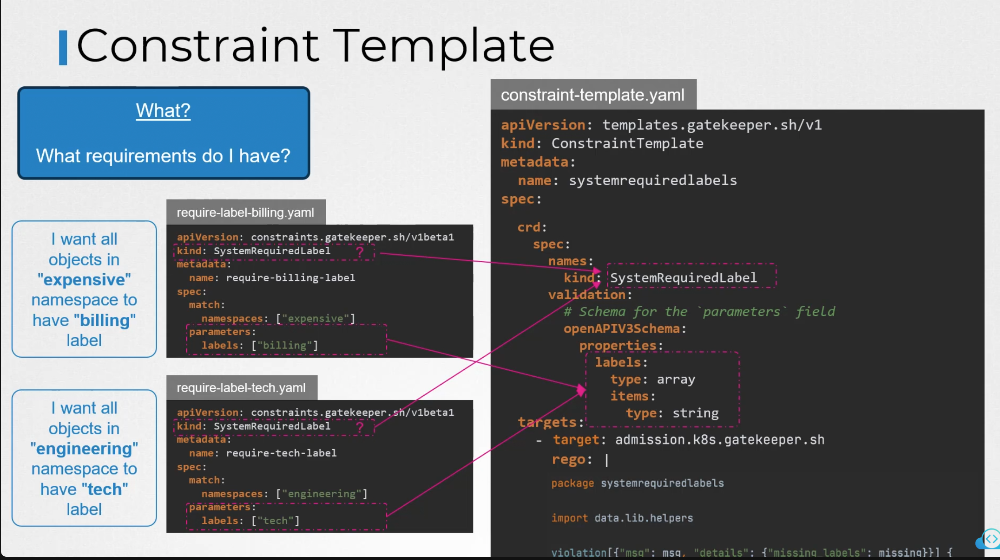

Now we can change label in rego to parameter:
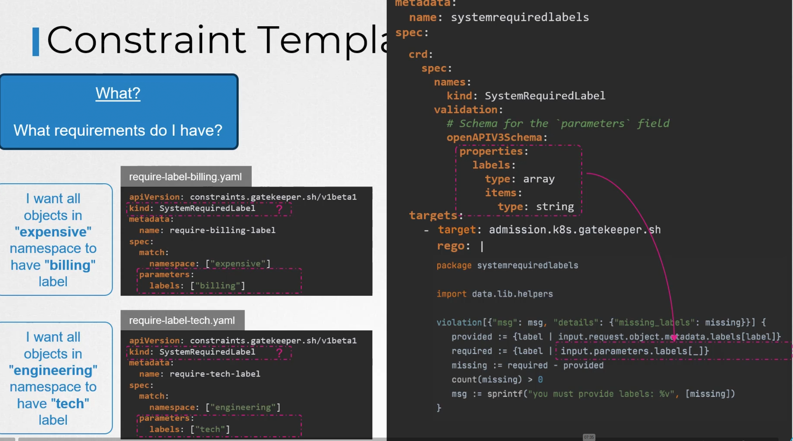
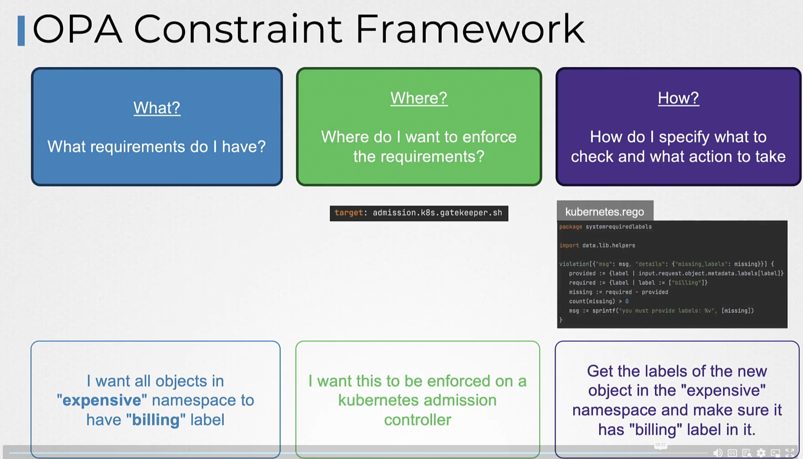
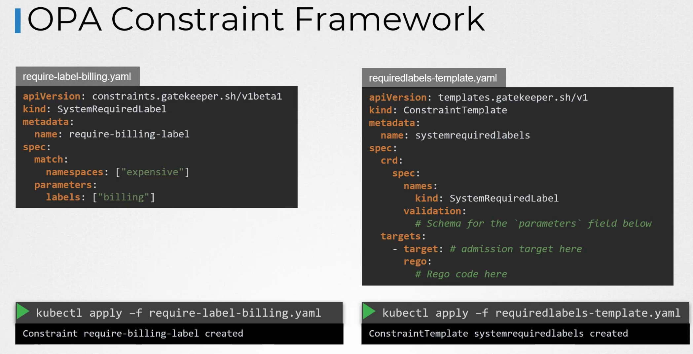
