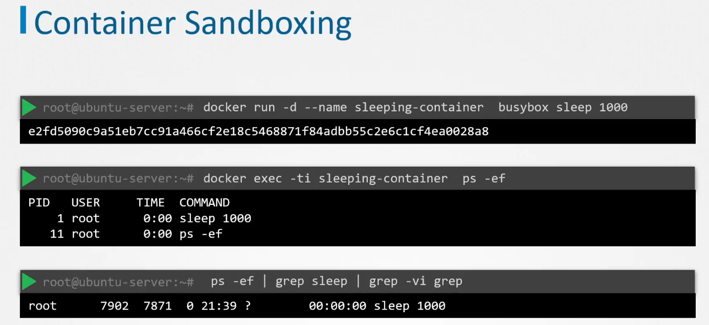
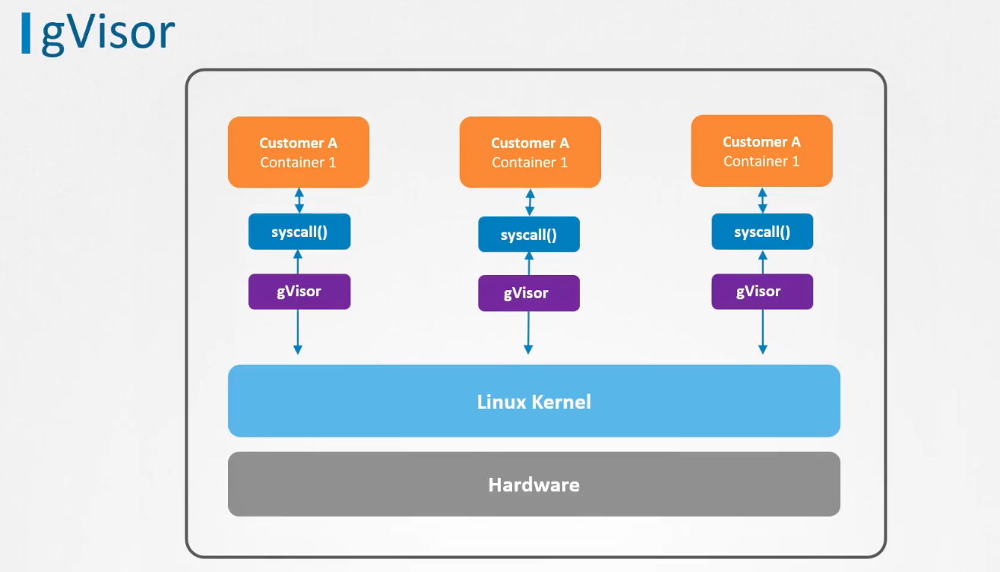
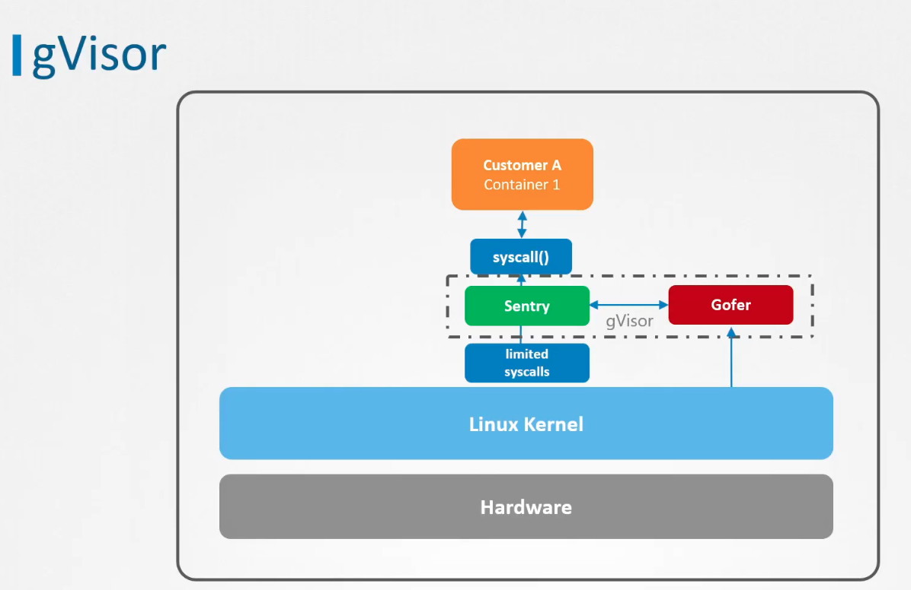
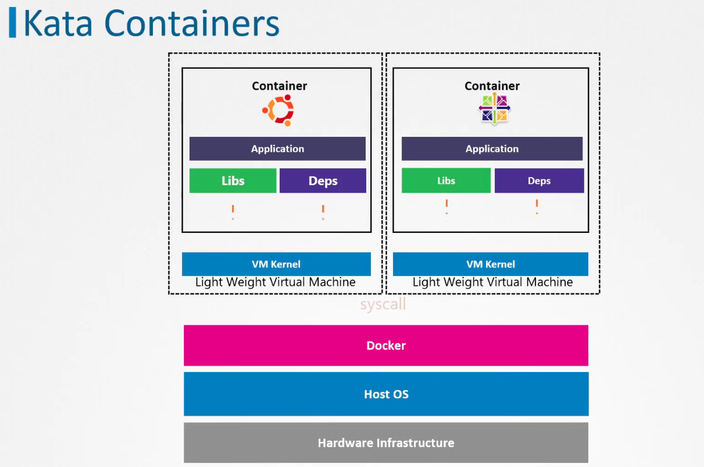
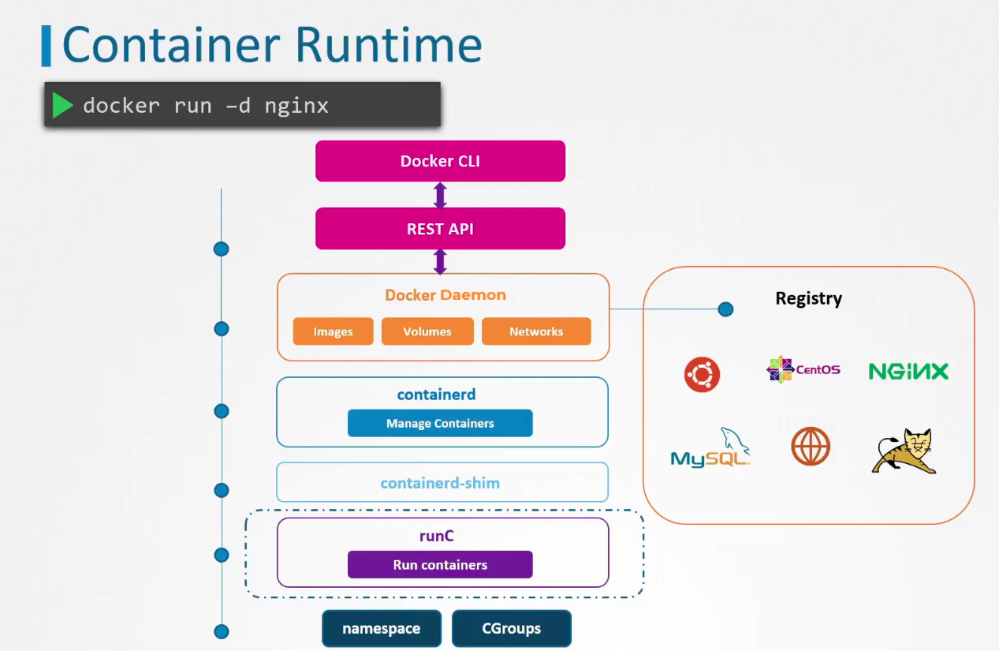
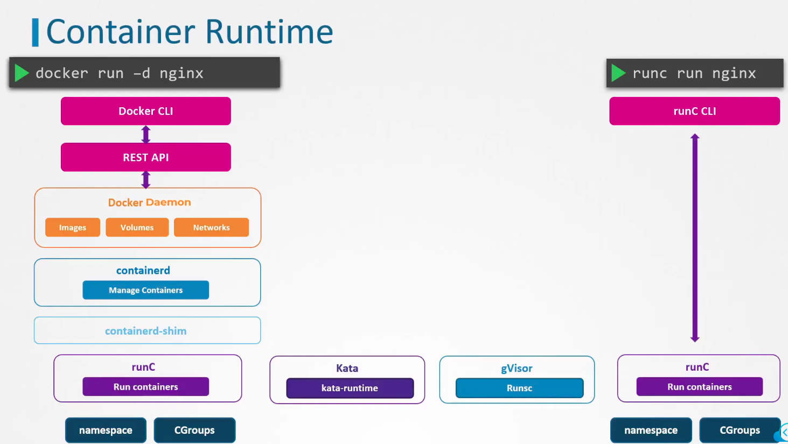
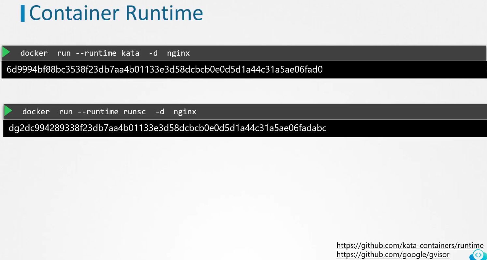
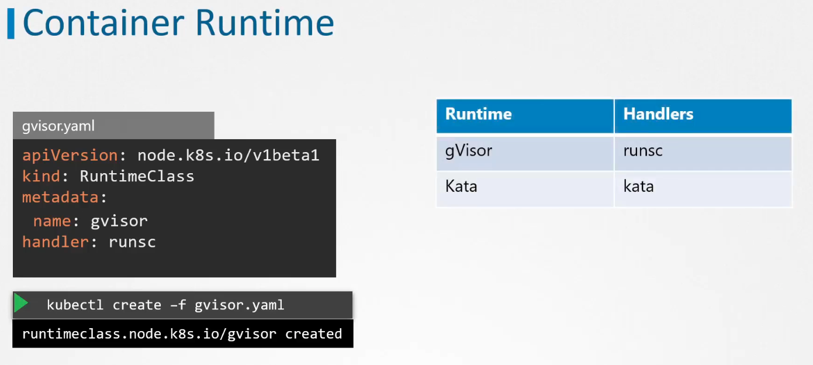
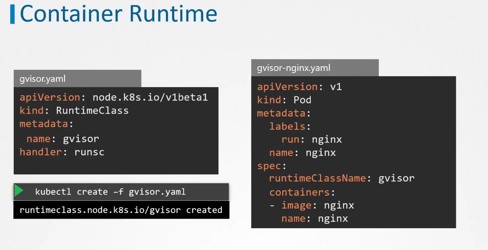
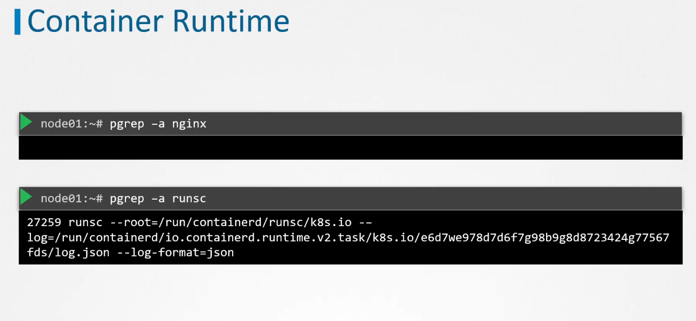

# Container Sandboxing

PID namespaces - PID of the process run in container is different in container and on host:

That's how processes are isolated.

## Restricting syscalls
We learned about different approaches to restricting syscalls - seccomp, AppArmor. They are good if we run similar programs in our containers. But if we have a lot of differnet applications, maintaining profiles for each can be a tedious task. Let's explore other approaches then.

## gVisor
Additional layer of isolation

Sentry - independent application layer kernel which is dedicated for containers. Main purpose is to intercept and respod to system calls which are made by containarized application.

Gofer - file proxy that implements logic that is needed for containarized apps to access the system files.

For network operations gVisor makes use of its own network stack. Just like previous measures, this makes sure that the network operations can be done withour containers directly interacting with the operating system's network code, and hence improving the isolation.

Drawback - not all apps will work with gVisor

## Kata Containers
Kata installs each container into different lightweight virtual machine.

each container is getting it's own kernel this way.
Minus - small performance penalty and it requires nested virtualizaion which is not common in cloud providers.

## Runtime classes

Sandboxing can be run on runC level:

when we run this nginx container we can see the isolation on the host:

we no longer see nginx process on the host, but we see gvisor process. That's what we wanted.
