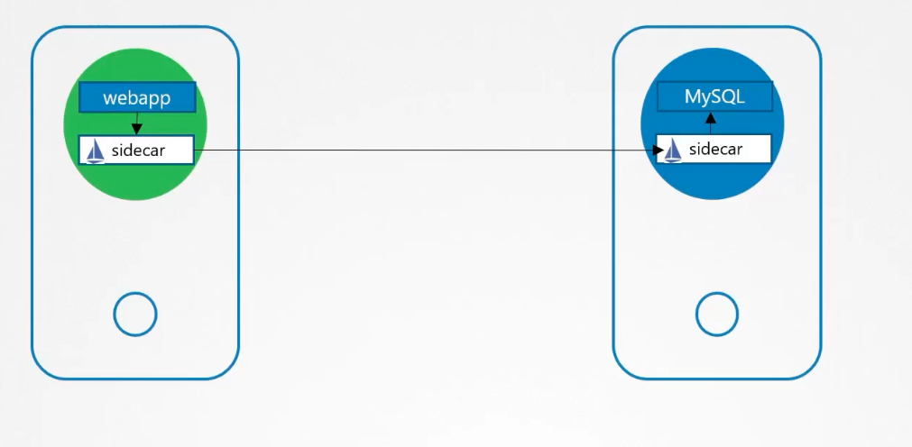
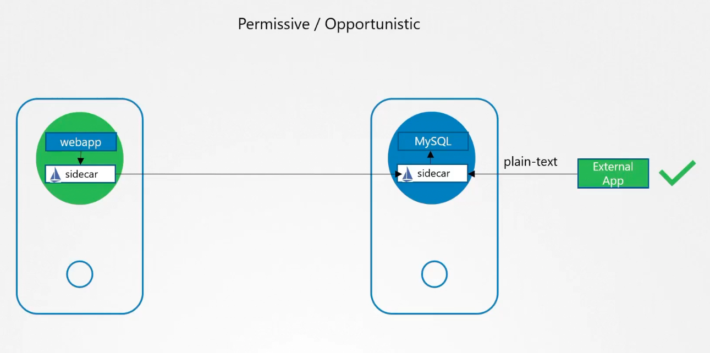

# mTLS - mutual TLS

Mutual verification of TLS certificate (client & server).
For mTLS pod-to-pod communication can be used tools such as Istio and Linkerd (Service Mesh).

Different modes supported by Istio:

drawback - not all external applications support mTLS.