# Multi-tenancy

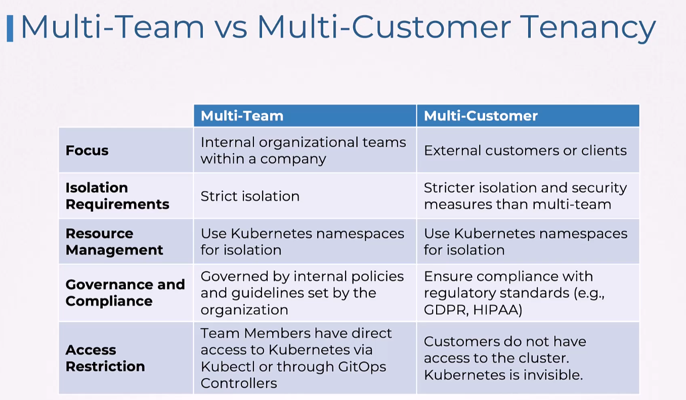
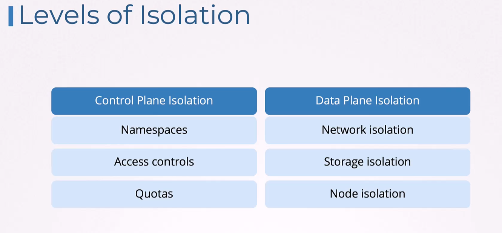
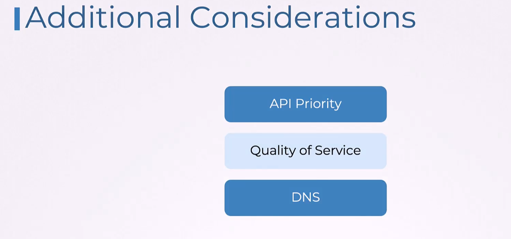

## API Priority & Fairness

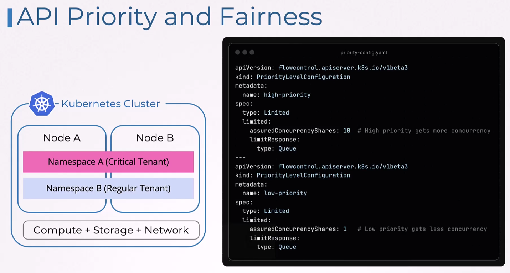
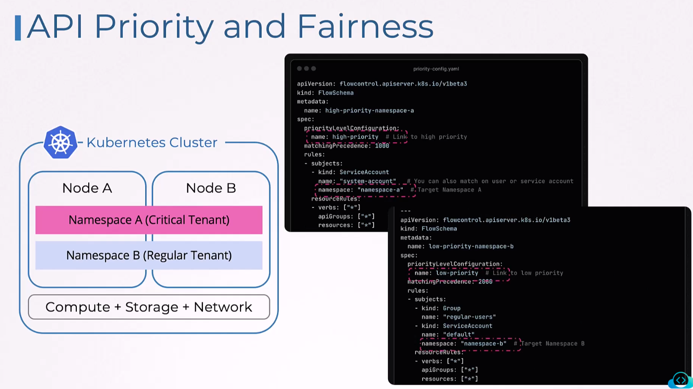
Those priorities were set on namespace, but can be set on any of these:
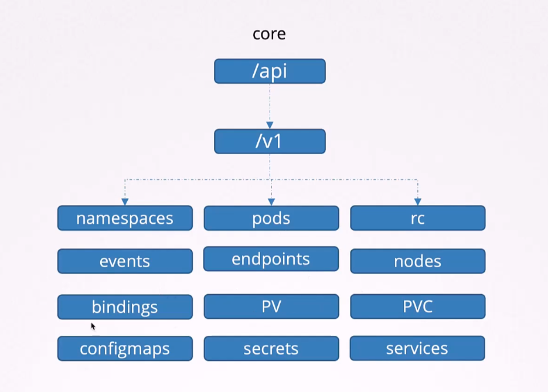
## Pod priority and preemption
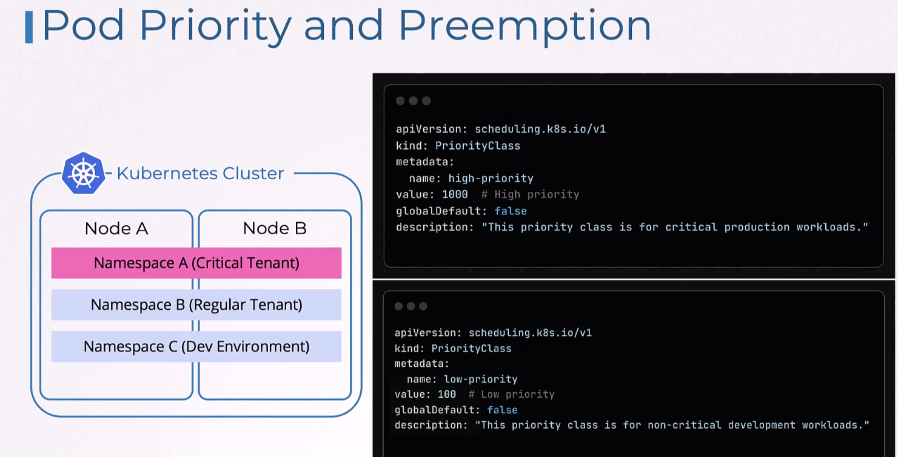
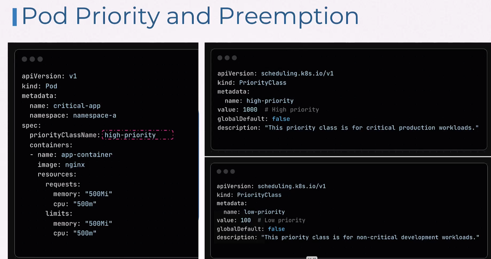

## Comparison of both
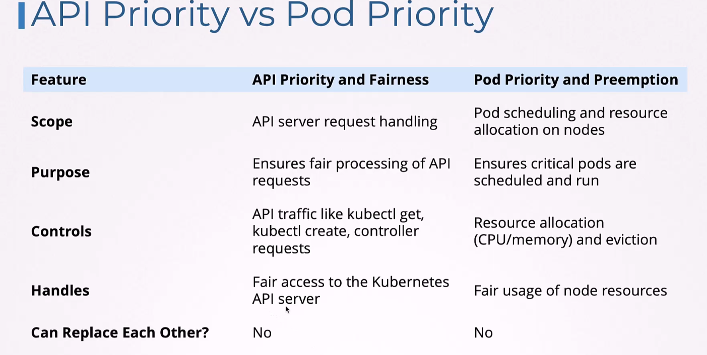

## QoS
Resource requests and limits in terms of resources.
In terms of network:
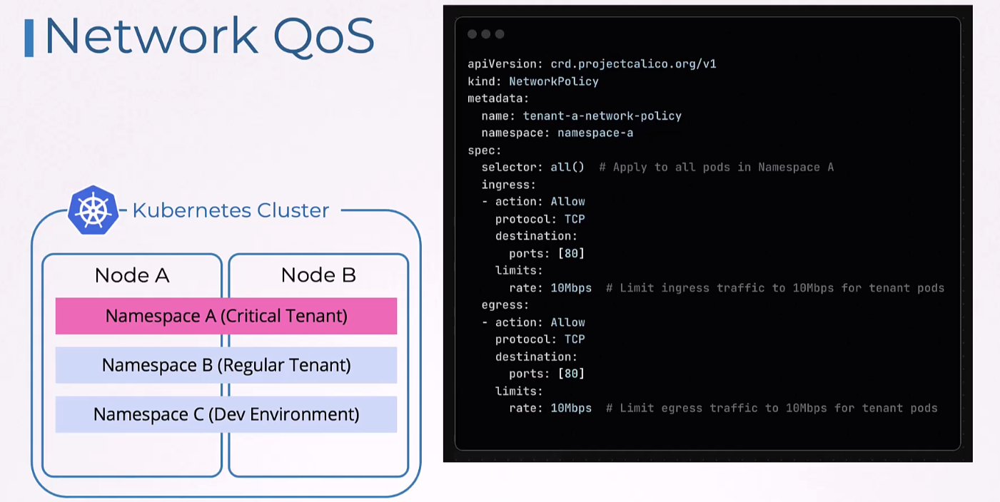
it's a calico network policy  

In terms of storage:
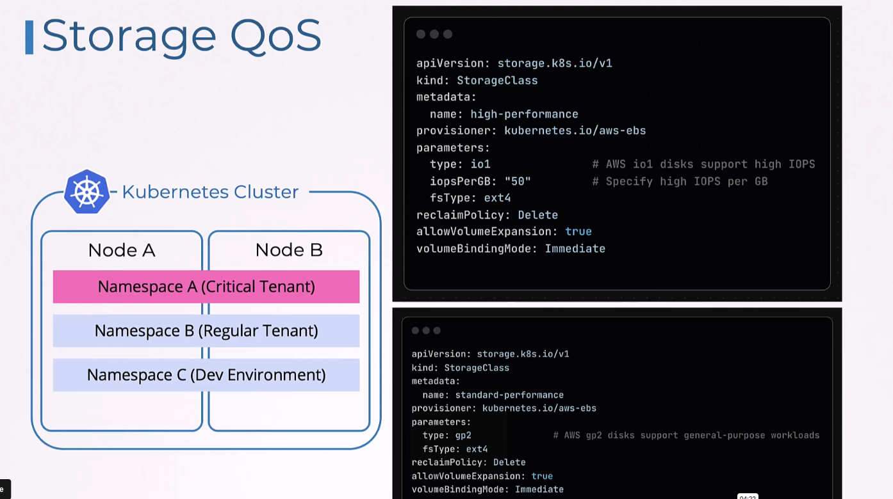

## DNS isolation

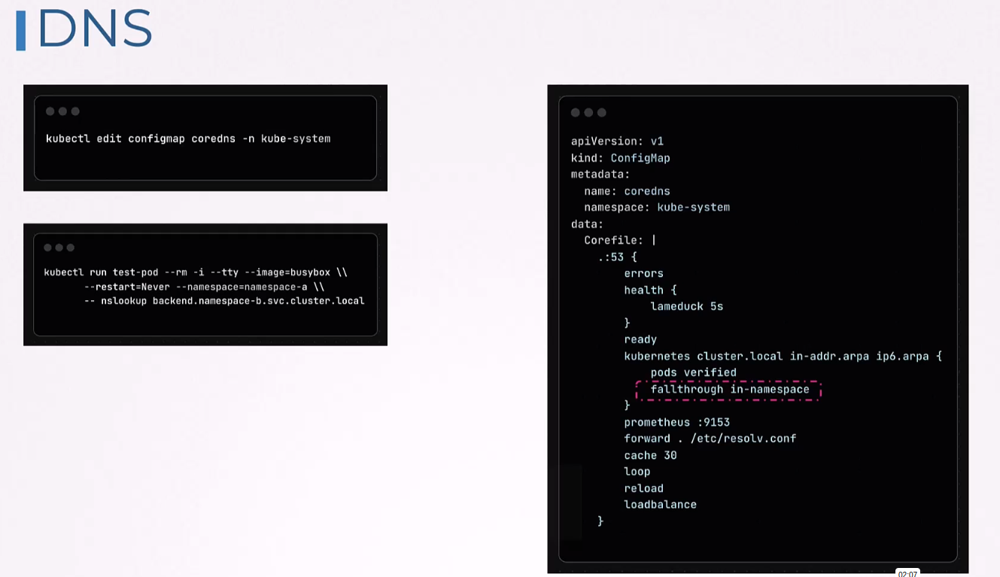
this coredns config makes name resolution possible only within pods own namespace.

