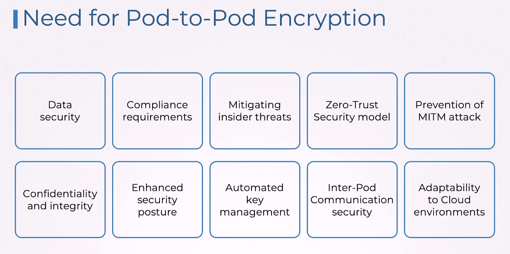
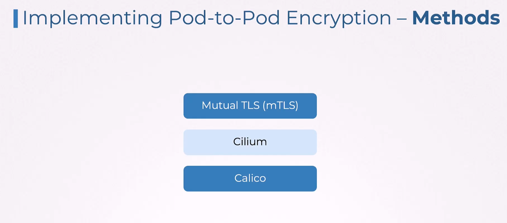
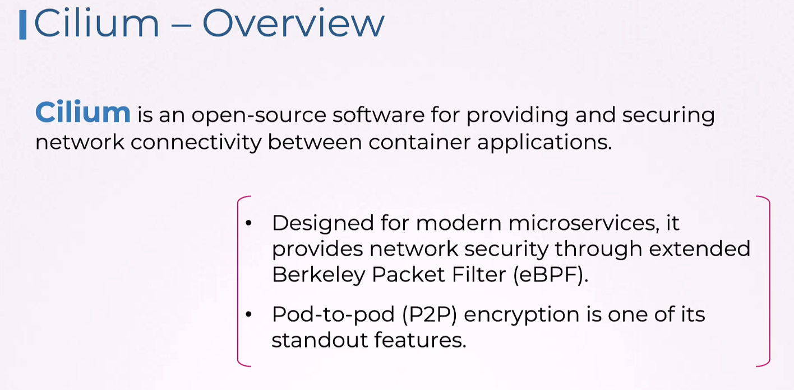
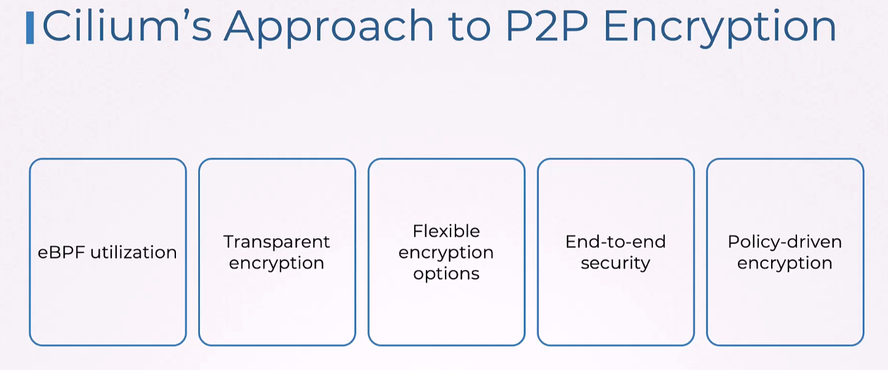
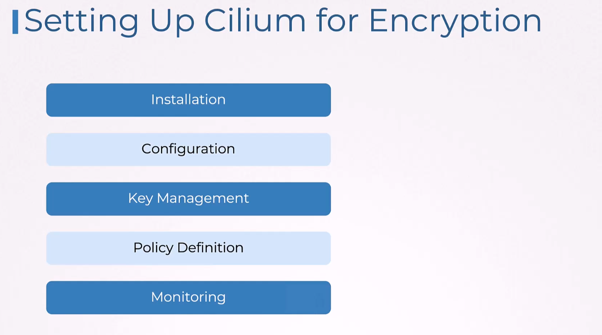
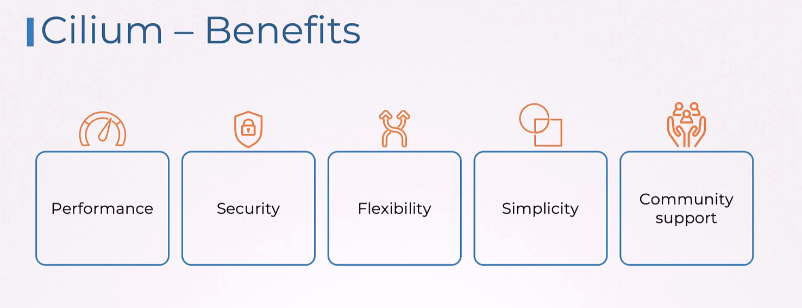
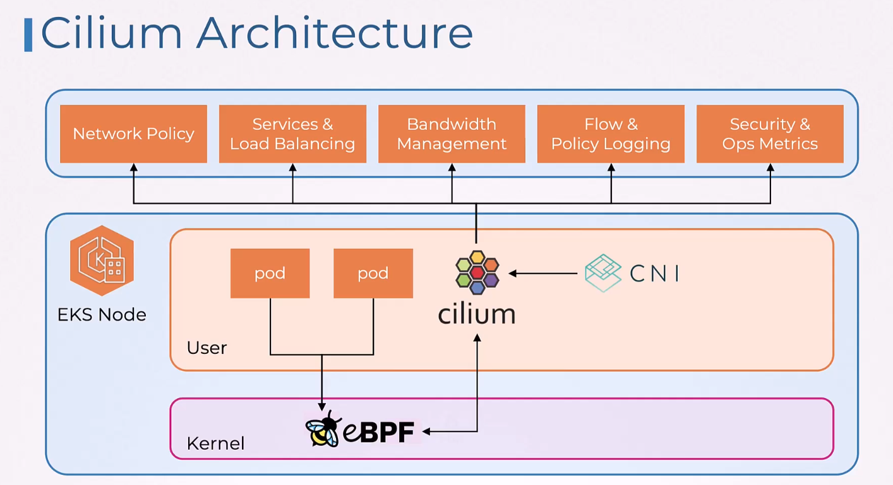
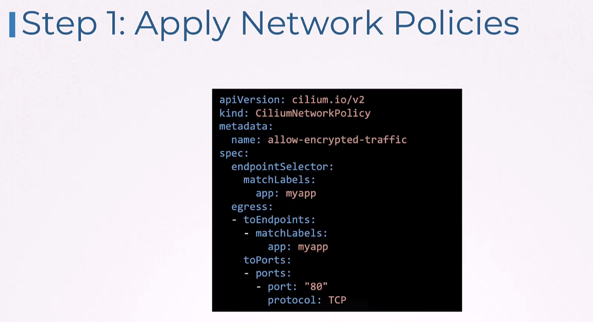
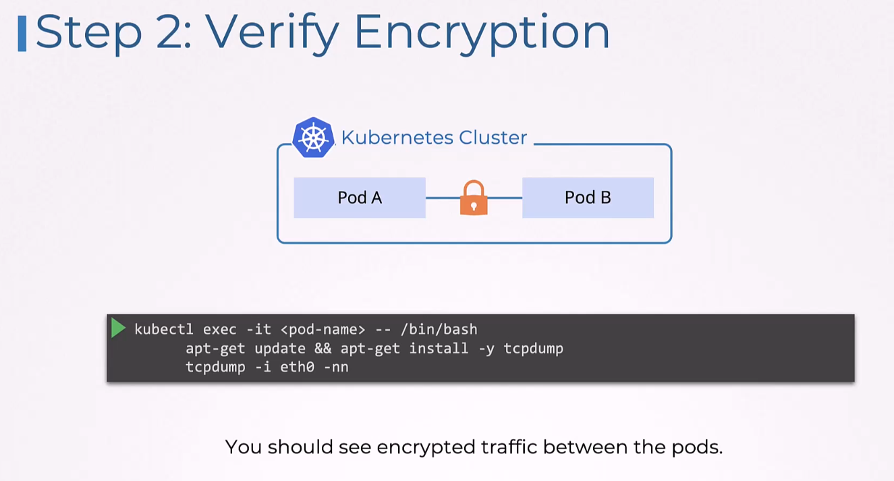

# Pod to pod encryption




mTLS - service mesh like Istio  
Cilium - uses IPsec or wireguard  
Calico - uses IPSec  

## Cilium
### Installation
Installing Cilium and Enabling Encryption  
Enable encryption by installing Cilium with encryption enabled:

Add the Cilium Helm repository
```helm repo add cilium https://helm.cilium.io/```

Install Cilium with encryption enabled
```
helm install cilium cilium/cilium --version 1.16.3 \
  --namespace kube-system \
  --set encryption.enabled=true \
  --set encryption.type=wireguard
```
You can verify that Cilium is running and that encryption is enabled by running the following commands:

Wait for the status of cilium to be OK  
```cilium status```
Check the encryption status of the Cilium installation  
```cilium encryption status```







