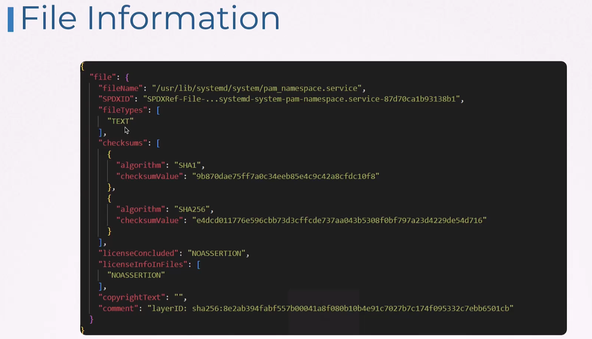

# Software Bill of Materials (SBOM)


## SBOM Formats
SPDX - focus on licensing and legal aspect  
CycloneDX - focus on security


### SPDX
Tool used - syft




### CycloneDX


### Comparison


## SBOM Workflow


### Generate

```syft docker.io/kodekloud/webapp-color:latest -o spdx > /root/webapp-spdx.sbom```  
```syft docker.io/kodekloud/webapp-color:latest -o cyclonedx-json > /root/webapp-sbom.json```

### Store SBOM


### Scan SBOM

```
~ ➜  grype sbom:/root/webapp-sbom.json -o json > /root/grype-report.json
 ✔ Vulnerability DB                [updated]  
 ✔ Scanned for vulnerabilities     [147 vulnerability matches]  
   ├── by severity: 19 critical, 74 high, 50 medium, 1 low, 0 negligible (3 unknown)
   └── by status:   79 fixed, 68 not-fixed, 0 ignored 

~ ➜  
```

### Analyze rezults

Getting details about critical:
```
~ ➜  grype sbom:/root/webapp-sbom.json -q | grep -i "Critical"
busybox                1.28.4-r1                                                              apk     CVE-2022-48174       Critical  
busybox                1.28.4-r1                                                              apk     CVE-2018-1000517     Critical  
libbz2                 1.0.6-r6          1.0.6-r7                                             apk     CVE-2019-12900       Critical  
musl                   1.1.19-r10        1.1.19-r11                                           apk     CVE-2019-14697       Critical  
musl-utils             1.1.19-r10        1.1.19-r11                                           apk     CVE-2019-14697       Critical  
python                 3.6.6             3.6.13, 3.7.10, 3.8.7, 3.9.1                         binary  CVE-2022-48565       Critical  
python                 3.6.6             3.10.9, 3.7.16, 3.8.16, 3.9.16                       binary  CVE-2022-37454       Critical  
python                 3.6.6             3.10.0, 3.6.13, 3.7.10, 3.8.8, 3.9.2                 binary  CVE-2021-3177        Critical  
python                 3.6.6             3.6.13, 3.7.10, 3.8.7, 3.9.1                         binary  CVE-2020-27619       Critical  
python                 3.6.6             2.7.17, 3.5.8, 3.6.9, 3.7.4                          binary  CVE-2019-9948        Critical  
python                 3.6.6             2.7.17, 3.4.10, 3.5.7, 3.6.9, 3.7.3                  binary  CVE-2019-9636        Critical  
python                 3.6.6             2.7.17, 3.5.8, 3.6.9, 3.7.4                          binary  CVE-2019-10160       Critical  
sqlite-libs            3.24.0-r0                                                              apk     CVE-2020-11656       Critical  
sqlite-libs            3.24.0-r0         3.25.3-r1                                            apk     CVE-2019-8457        Critical  
sqlite-libs            3.24.0-r0                                                              apk     CVE-2019-19646       Critical  
ssl_client             1.28.4-r1                                                              apk     CVE-2022-48174       Critical  
ssl_client             1.28.4-r1                                                              apk     CVE-2018-1000517     Critical  
zlib                   1.2.11-r1                                                              apk     CVE-2023-45853       Critical  
zlib                   1.2.11-r1                                                              apk     CVE-2022-37434       Critical  

~ ➜  
```

### Remediate Issues
Replace/update vulnerable components

### Monitor
Automated scaning, Regular updates and Monitoring.