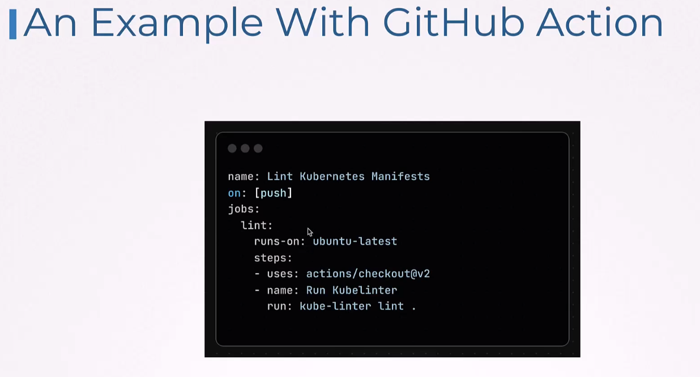

# Kubelinter


Features:
* Configurable checks
* Analysis and linting
* Report and suggestions


To run: ```kube-linter lint .```



## Applying kube-linter recommendation

Original manifest:
```yaml
apiVersion: apps/v1
kind: Deployment
metadata:
  name: nginx-deployment
  labels:
    app: nginx
spec:
  replicas: 3
  selector:
    matchLabels:
      app: nginx
  template:
    metadata:
      labels:
        app: nginx
    spec:
      containers:
      - name: nginx
        image: nginx:1.14.2
        ports:
        - containerPort: 80
```

Recommendations from kube-linter:
```
controlplane ~ ➜  kube-linter lint nginx.yml 
KubeLinter 0.7.1

/root/nginx.yml: (object: <no namespace>/nginx-deployment apps/v1, Kind=Deployment) object has 3 replicas but does not specify inter pod anti-affinity (check: no-anti-affinity, remediation: Specify anti-affinity in your pod specification to ensure that the orchestrator attempts to schedule replicas on different nodes. Using podAntiAffinity, specify a labelSelector that matches pods for the deployment, and set the topologyKey to kubernetes.io/hostname. Refer to https://kubernetes.io/docs/concepts/scheduling-eviction/assign-pod-node/#inter-pod-affinity-and-anti-affinity for details.)

/root/nginx.yml: (object: <no namespace>/nginx-deployment apps/v1, Kind=Deployment) container "nginx" does not have a read-only root file system (check: no-read-only-root-fs, remediation: Set readOnlyRootFilesystem to true in the container securityContext.)

/root/nginx.yml: (object: <no namespace>/nginx-deployment apps/v1, Kind=Deployment) container "nginx" is not set to runAsNonRoot (check: run-as-non-root, remediation: Set runAsUser to a non-zero number and runAsNonRoot to true in your pod or container securityContext. Refer to https://kubernetes.io/docs/tasks/configure-pod-container/security-context/ for details.)

/root/nginx.yml: (object: <no namespace>/nginx-deployment apps/v1, Kind=Deployment) container "nginx" has cpu request 0 (check: unset-cpu-requirements, remediation: Set CPU requests for your container based on its requirements. Refer to https://kubernetes.io/docs/concepts/configuration/manage-resources-containers/#requests-and-limits for details.)

/root/nginx.yml: (object: <no namespace>/nginx-deployment apps/v1, Kind=Deployment) container "nginx" has memory limit 0 (check: unset-memory-requirements, remediation: Set memory limits for your container based on its requirements. Refer to https://kubernetes.io/docs/concepts/configuration/manage-resources-containers/#requests-and-limits for details.)

Error: found 5 lint errors
```

Applied recommendations:

```yaml
controlplane ~ ➜  cat nginx.yml 
apiVersion: apps/v1
kind: Deployment
metadata:
  name: nginx-deployment
  labels:
    app: nginx
spec:
  replicas: 3
  selector:
    matchLabels:
      app: nginx
  template:
    metadata:
      labels:
        app: nginx
    spec:
      affinity:                                               #added
        podAntiAffinity:                                      #added
          requiredDuringSchedulingIgnoredDuringExecution:     #added
          - labelSelector:                                    #added
              matchExpressions:                               #added
              - key: app                                      #added
                operator: In                                  #added
                values:                                       #added
                - nginx                                       #added
            topologyKey: "kubernetes.io/hostname"             #added
      containers:
      - name: nginx
        image: nginx:1.14.2
        ports:
        - containerPort: 80
        resources:                      #added
          requests:                     #added
            memory: "64Mi"              #added
            cpu: "250m"                 #added
          limits:                       #added
            memory: "128Mi"             #added
            cpu: "500m"                 #added
        securityContext:               #added
          readOnlyRootFilesystem: true #added
          runAsUser: 1000              #added
          runAsNonRoot: true           #added     
```
