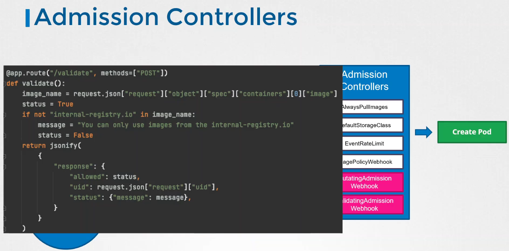

# Whitelisting docker registries

## Custom Admission Controller


## OPA


## ImagePolicyWebhook


### Example
Webhook server:
```yaml
apiVersion: v1
kind: Service
metadata:
  labels:
    app: image-bouncer-webhook
  name: image-bouncer-webhook
spec:
  type: NodePort
  ports:
    - name: https
      port: 443
      targetPort: 1323
      protocol: "TCP"
      nodePort: 30080
  selector:
    app: image-bouncer-webhook
---
apiVersion: apps/v1
kind: Deployment
metadata:
  name: image-bouncer-webhook
spec:
  selector:
    matchLabels:
      app: image-bouncer-webhook
  template:
    metadata:
      labels:
        app: image-bouncer-webhook
    spec:
      containers:
        - name: image-bouncer-webhook
          imagePullPolicy: Always
          image: "kainlite/kube-image-bouncer:latest"
          args:
            - "--cert=/etc/admission-controller/tls/tls.crt"
            - "--key=/etc/admission-controller/tls/tls.key"
            - "--debug"
            - "--registry-whitelist=docker.io,registry.k8s.io"
          volumeMounts:
            - name: tls
              mountPath: /etc/admission-controller/tls
      volumes:
        - name: tls
          secret:
            secretName: tls-image-bouncer-webhook
```

AdmissionConfiguration manifest placed in /etc/kubernetes/pki/admission_configuration.yaml on master node:
```yaml
apiVersion: apiserver.config.k8s.io/v1
kind: AdmissionConfiguration
plugins:
- name: ImagePolicyWebhook
  configuration:
    imagePolicy:
      kubeConfigFile: /etc/kubernetes/pki/admission_kube_config.yaml
      allowTTL: 50
      denyTTL: 50
      retryBackoff: 500
      defaultAllow: false
```
kubeconfig placed in /etc/kubernetes/pki/admission_kube_config.yaml:
```yaml
apiVersion: v1
kind: Config
clusters:
- cluster:
    certificate-authority: /etc/kubernetes/pki/server.crt
    server: https://image-bouncer-webhook:30080/image_policy
  name: bouncer_webhook
contexts:
- context:
    cluster: bouncer_webhook
    user: api-server
  name: bouncer_validator
current-context: bouncer_validator
preferences: {}
users:
- name: api-server
  user:
    client-certificate: /etc/kubernetes/pki/apiserver.crt
    client-key:  /etc/kubernetes/pki/apiserver.key

controlplane /etc/kubernetes/pki ➜
```
Then add to kubeconfig arguments:
```
    - --enable-admission-plugins=NodeRestriction,ImagePolicyWebhook
    - --admission-control-config-file=/etc/kubernetes/pki/admission_configuration.yaml
```
