# Falco
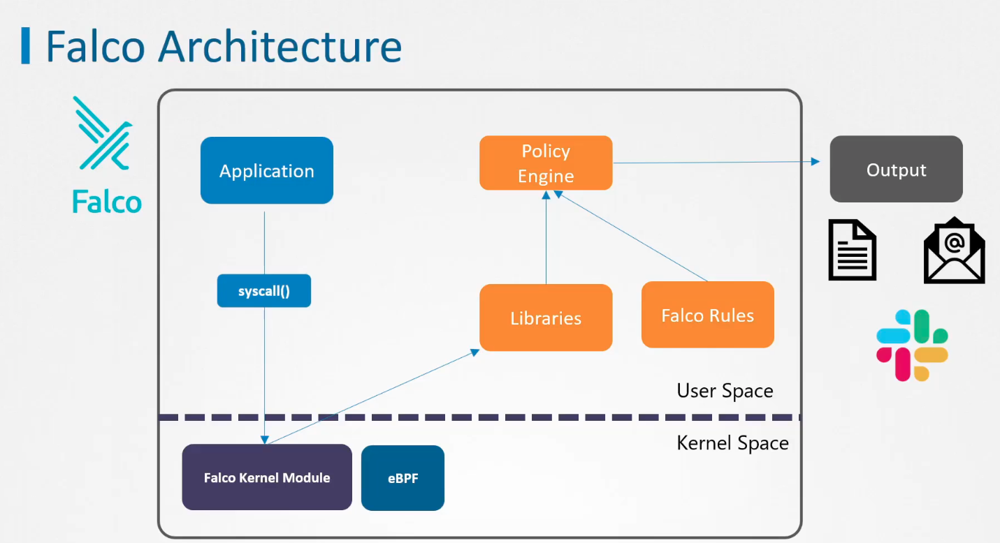
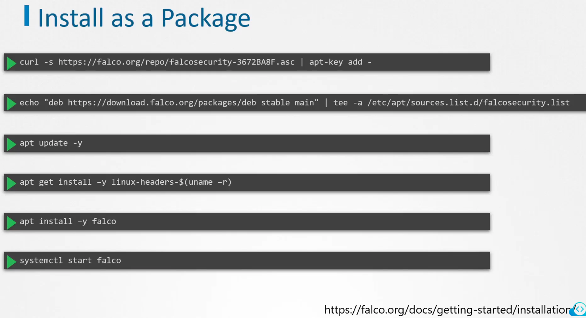
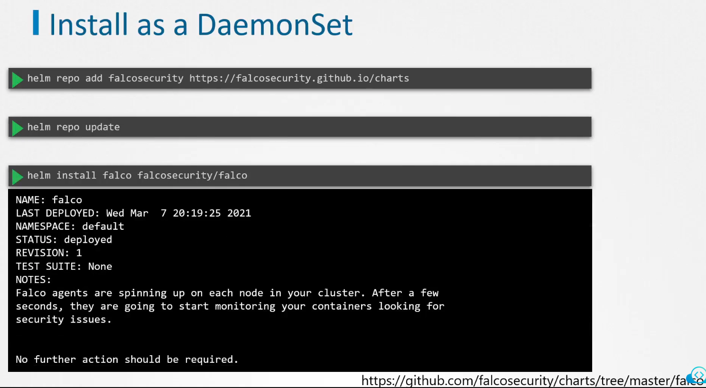
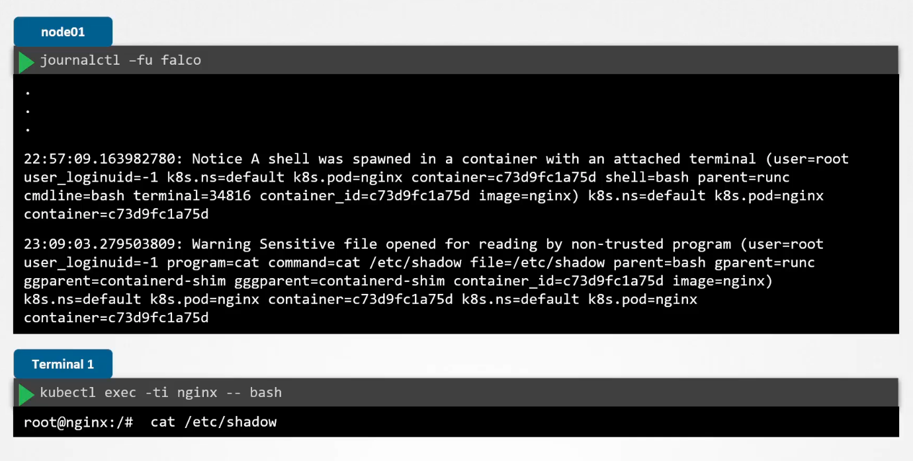
## Falco rules
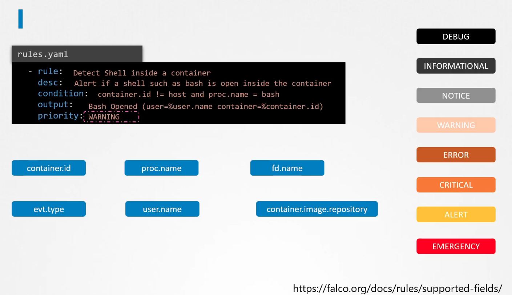
### Marcos and lists
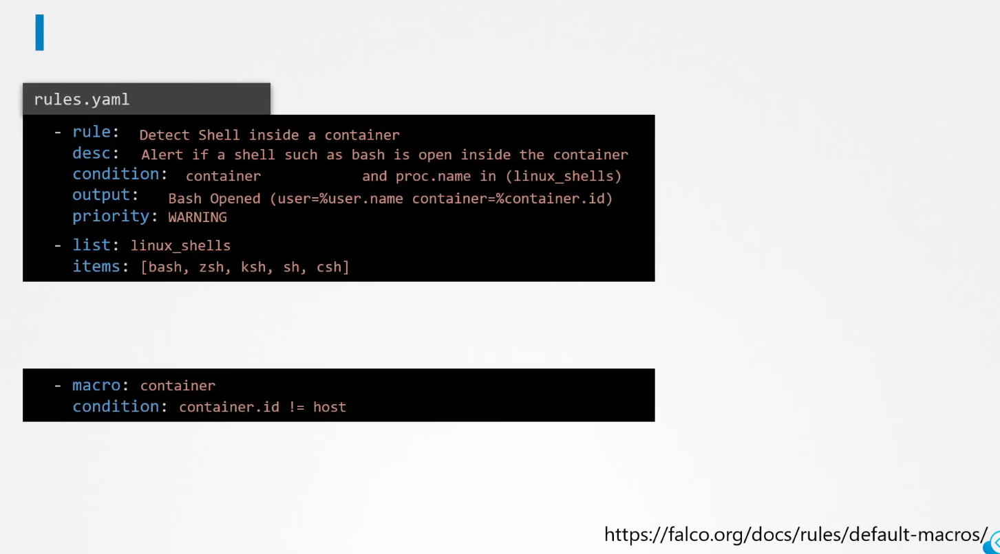

## Falco configuration
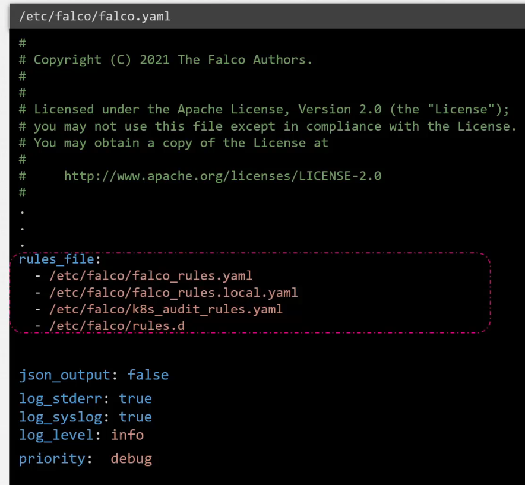
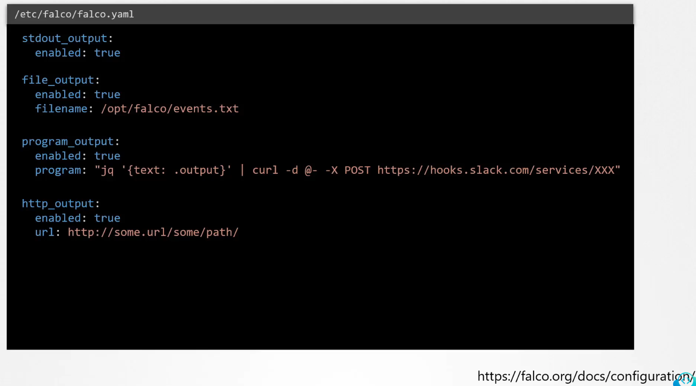
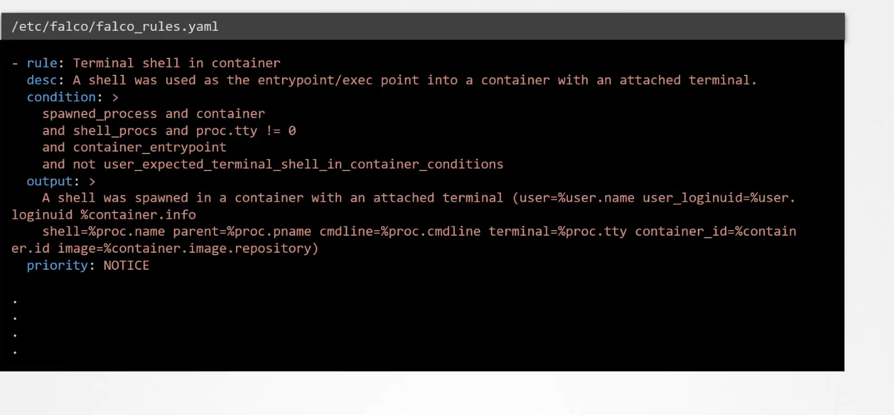
This falco_rules.yaml will be overwritten when updating falco. So custom rules need to be applied in local file:
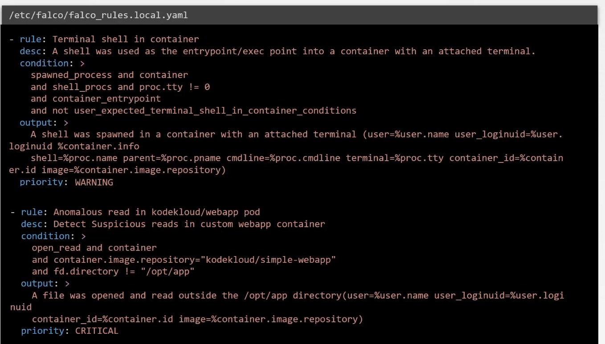
After adding issue hot reload:
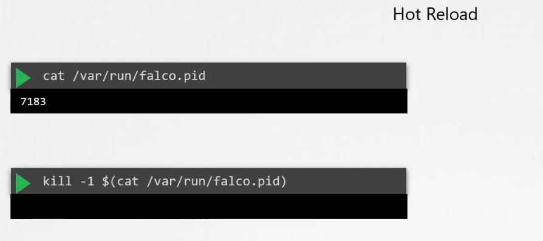

## References
https://falco.org/docs/getting-started/installation/

https://github.com/falcosecurity/charts/tree/master/falco

https://falco.org/docs/rules/supported-fields/

https://falco.org/docs/rules/default-macros/

https://falco.org/docs/configuration/
