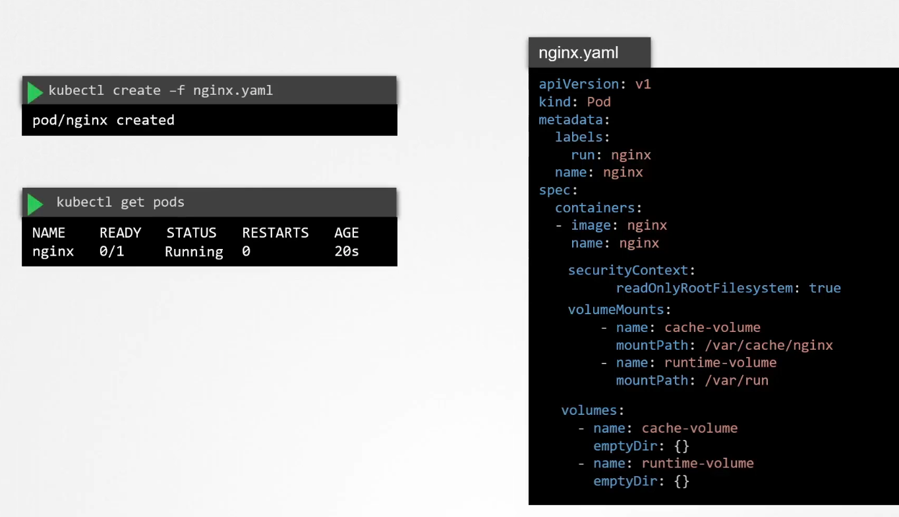
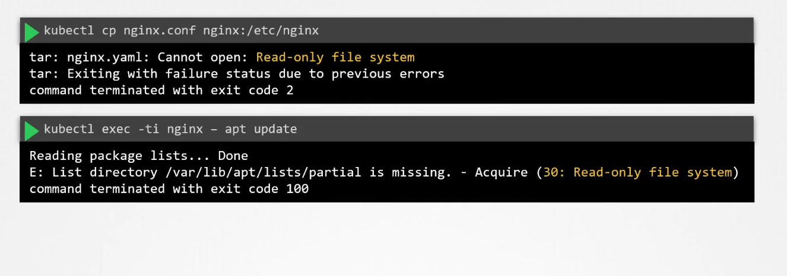
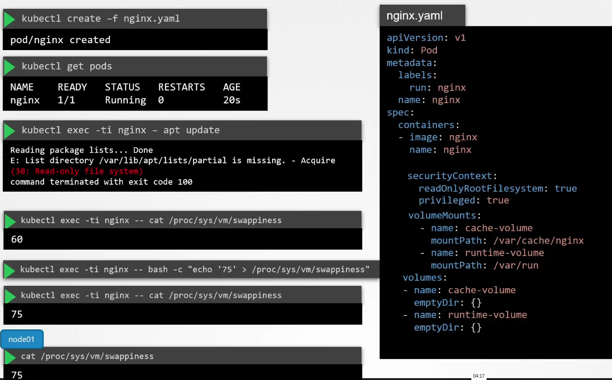
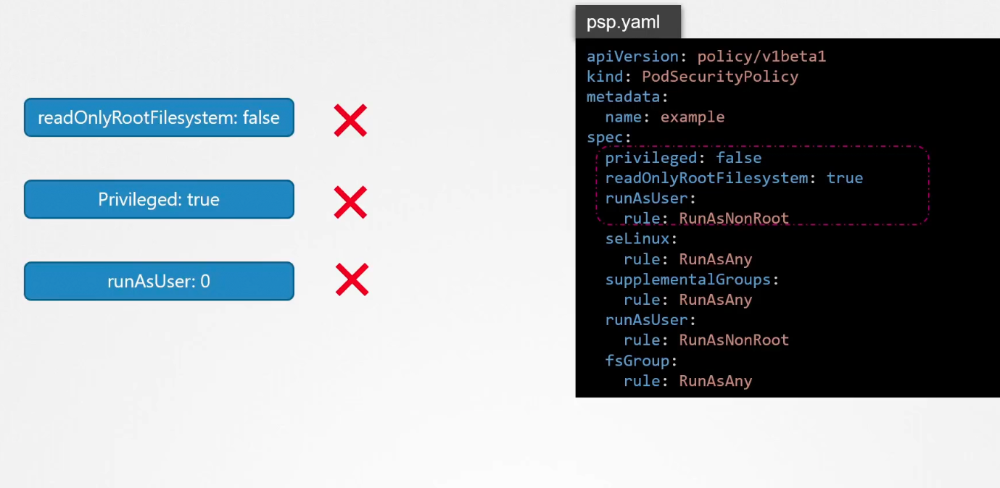

# Immutable containers
By default you can copy config to containers and have config drift. To ensure immutability of containers you must change root filesystem to read only (but remember about writeable /var/ for some catalogs):

Effect:

Refrain from using privileged containers. This is what can happen despite having read only file system:

Best practise: add PSP:

