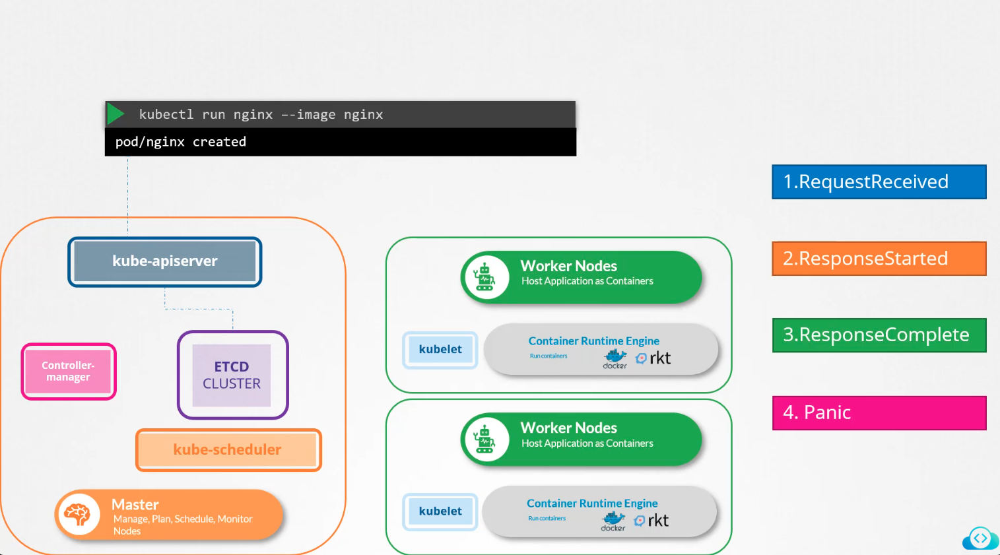
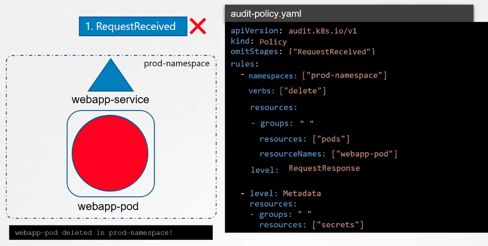
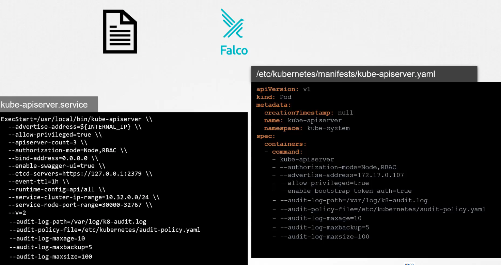
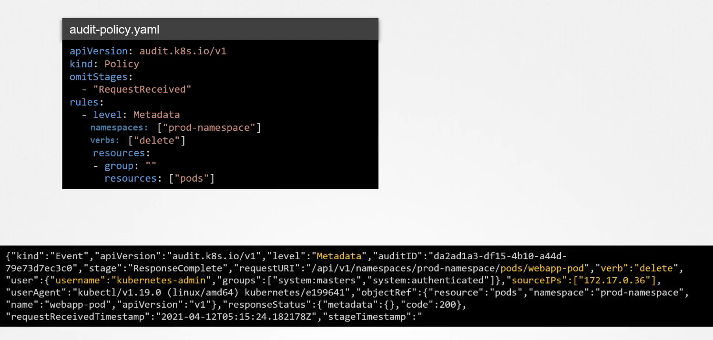

# Audit logs
Auditing is disabled by default.

## Requests in k8s
Request - e.g. create nginx pod

Request is made to kube-apiserver. Then sequence is as follows
1. RequestReceived - event generated in respect to validity of the request, authentication and authorization
2. ResponseStarted - event generated that need some time to complete. E.g. if you add --watch flag
3. ResponseComplete
4. Panic - in case of errors

## Audit policy

Levels (lowest to hightest verbosity):
* None
* Metadata - only timestamp, resources, words will be logged
* Request
* RequestResponse

## Enabling auditing in the cluster
 
Effect:


**IMPORTANT**: remember about adding volume and volume mounts! 

Example:  
Create /etc/kubernetes/prod-audit.yaml as below:
```yaml
apiVersion: audit.k8s.io/v1
kind: Policy
rules:
- level: Metadata
  namespaces: ["prod"]
  verbs: ["delete"]
  resources:
  - group: ""
    resources: ["secrets"]
```
Next, make sure to enable logging in api-server:
```
 - --audit-policy-file=/etc/kubernetes/prod-audit.yaml
 - --audit-log-path=/var/log/prod-secrets.log
 - --audit-log-maxage=30
```
Then, add volumes and volume mounts as shown in the below snippets.
volumes:
```
  - name: audit
    hostPath:
      path: /etc/kubernetes/prod-audit.yaml
      type: File

  - name: audit-log
    hostPath:
      path: /var/log/prod-secrets.log
      type: FileOrCreate
```
volumeMounts:
```
  - mountPath: /etc/kubernetes/prod-audit.yaml
    name: audit
    readOnly: true
  - mountPath: /var/log/prod-secrets.log
    name: audit-log
    readOnly: false
```
